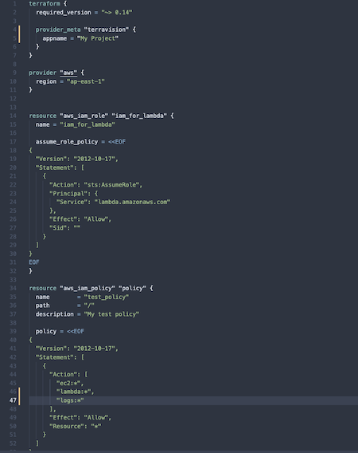
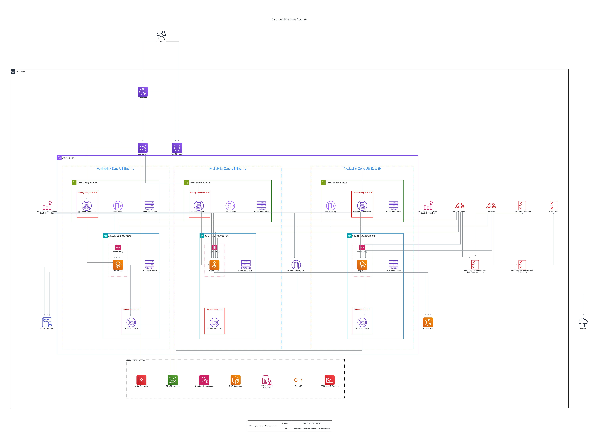
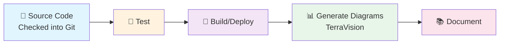

# TerraVision

**AI-Powered Terraform to Architecture Diagram Generator**

[](https://github.com/patrickchugh/terravision/actions/workflows/lint-and-test.yml)
[](https://pypi.org/project/terravision/)
[](https://pypi.org/project/terravision/)
[](https://pypi.org/project/terravision/)
[](https://github.com/patrickchugh/terravision/stargazers)
[](https://github.com/patrickchugh/terravision/network)
[](https://github.com/patrickchugh/terravision/issues)
[](https://github.com/patrickchugh/terravision/blob/main/LICENSE)
[](https://github.com/psf/black)

> **⚠️ Alpha Software Notice**  
> This software is in alpha testing. Code is shared "AS IS" without warranties. Use at your own risk.

---

## Table of Contents

- [What is TerraVision?](#what-is-terravision)
- [Quick Start](#quick-start)
- [Key Features](#key-features)
- [Installation](#installation)
- [Basic Usage](#basic-usage)
- [Documentation](#documentation)
- [Supported Cloud Providers](#supported-cloud-providers)
- [Contributing](#contributing)
- [License](#license)

---

## What is TerraVision?

TerraVision automatically converts your Terraform code into professional cloud architecture diagrams. Quickly visualise any Terraform code to analyse what would be created in the cloud, AND keep your documentation in sync with your infrastructure. No more outdated diagrams!

**Turn this Terraform code:**



**Into this architecture diagram:**



### Why TerraVision?

- ✅ **Always Up-to-Date**: Diagrams generated from actual Terraform code as the single source of truth
- ✅ **100% Client-Side**: No cloud access required, runs locally to keep your data secure
- ✅ **CI/CD Ready**: Automate diagram generation in a pipeline whenever a PR is merged
- ✅ **Free & Open Source**: No expensive diagramming tool licenses
- ✅ **Multi-Cloud**: Supports AWS, GCP, and Azure

---

## Key Features

### 🎨 Professional Diagrams

- Industry-standard cloud provider icons (AWS, GCP, Azure)
- Automatic resource grouping (VPCs, subnets, security groups)
- Clean, readable layouts
- Multiple output formats (PNG, SVG, PDF and DOT)

### 🤖 AI-Powered Refinement

- Automatically fixes resource relationships
- Adds missing logical connections, labels, titles and icons as needed
- Ensures architectural diagramming best practices

### 📝 Customizable Annotations

- Add custom labels and titles
- Include external resources not in Terraform
- Override automatic connections

### 🔄 CI/CD Integration

- GitHub Actions, GitLab CI, Jenkins support
- Show multiple environments using TF Variables to document variants of your infrastructure (e.g. prod vs dev)

### 🔒 Secure & Private

- No cloud credentials required
- Runs entirely on your local machine
- No external API calls (except optional AI features)

---

## Quick Start

### Prerequisites

Before installing TerraVision, ensure you have:

- **Python 3.10+** - [Download Python](https://www.python.org/downloads/)
- **Terraform 1.x** - [Install Terraform](https://developer.hashicorp.com/terraform/downloads)
- **Graphviz** - [Install Graphviz](https://graphviz.org/download/)
- **Git** - [Install Git](https://git-scm.com/downloads)
- **Ollama** (Optional - for local AI refinement) - [Install Ollama](https://ollama.ai/download)

### Install TerraVision

```bash
pipx install terravision # only if in a virtual env, you can use pip install terravision instead
```

### Verify Terraform Setup

Before generating diagrams, ensure Terraform is working:

```bash
# Verify Terraform is installed
terraform version
# Should show v1.0.0 or higher

# Configure cloud provider credentials
# AWS:
export AWS_ACCESS_KEY_ID="your-access-key"
export AWS_SECRET_ACCESS_KEY="your-secret-key"
# Or: aws configure

# Azure:
export ARM_CLIENT_ID="your-client-id"
export ARM_CLIENT_SECRET="your-client-secret"
export ARM_TENANT_ID="your-tenant-id"
export ARM_SUBSCRIPTION_ID="your-subscription-id"
# Or: az login

# GCP:
export GOOGLE_CREDENTIALS="path/to/service-account-key.json"
# Or: gcloud auth application-default login

# Test Terraform can initialize and plan
cd tests/fixtures/aws_terraform/static-website  # or azure_terraform/test_vm_vmss
terraform init
terraform plan
# Should complete without errors
cd -
```

**Note**: TerraVision needs Terraform to successfully run `terraform plan` to parse your infrastructure. Cloud credentials are required for TERRAFORM to validate resources and resolve functions, but TerraVision itself never accesses your cloud account.

**Important for Terraform Enterprise and Remote Backend Users**: TerraVision automatically forces local backend execution (ignoring remote state) to generate diagrams showing the complete infrastructure definition, not just deltas. This ensures accurate architecture visualization regardless of your configured backend.

### Try It Out!

Generate your first diagram using our example Terraform code:

```bash

git clone https://github.com/patrickchugh/terravision.git
cd terravision

# Example 1: EKS cluster with managed nodes and OIDC
terravision draw --source tests/fixtures/aws_terraform/eks_managed_nodes --show

# Example 2: Azure VM stack set
terravision draw --source tests/fixtures/azure_terraform/test_vm_vmss --show

# Example 3: From a public Git repository and only look at subfolder /aws/wordpress_fargate (note double slash)
terravision draw --source https://github.com/patrickchugh/terraform-examples.git//aws/wordpress_fargate --show
```

**That's it!** Your diagram is saved as `architecture.png` and automatically opened.

### Use Your Own Terraform Code

```bash
# Generate diagram from your Terraform directory
terravision draw --source /path/to/your/terraform/code
```

### Use TerraVision simply as a drawing engine with a simple JSON dict
```bash
# Generate diagram from a simple JSON file
terravision draw --source tests/json/bastion-expected.json
```


---

## Installation for Developers / Power Users

**Detailed installation instructions**: See [docs/INSTALLATION.md](docs/INSTALLATION.md)

---

## Basic Usage

### Generate a Diagram

```bash
# From local Terraform directory
terravision draw --source ./terraform

# From Git repository
terravision draw --source https://github.com/user/repo.git

# With custom output format
terravision draw --source ./terraform --format svg --outfile my-architecture

# Open diagram automatically
terravision draw --source ./terraform --show
```

### Common Options

| Option        | Description                   | Example                    |
| ------------- | ----------------------------- | -------------------------- |
| `--source`    | Terraform code location       | `./terraform` or Git URL   |
| `--format`    | Output format                 | `png`, `svg`, `pdf`, `bmp` |
| `--outfile`   | Output filename               | `architecture` (default)   |
| `--workspace` | Terraform workspace           | `production`, `staging`    |
| `--varfile`   | Variable file                 | `prod.tfvars`              |
| `--show`      | Open diagram after generation | (flag)                     |
| `--debug`     | Enable debug output           | (flag)                     |

### Export Graph Data

```bash
# Export resource relationships as JSON
terravision graphdata --source ./terraform --outfile resources.json
```

**More examples**: See [docs/USAGE_GUIDE.md](docs/USAGE_GUIDE.md)

---

## Documentation

### For Users

- **[Installation Guide](docs/INSTALLATION.md)** - Detailed setup instructions
- **[Usage Guide](docs/USAGE_GUIDE.md)** - Commands, options, and examples
- **[Annotations Guide](docs/ANNOTATIONS.md)** - Customize your diagrams
- **[CI/CD Integration](docs/CICD_INTEGRATION.md)** - Automate diagram generation
- **[Troubleshooting](docs/TROUBLESHOOTING.md)** - Common issues and solutions

### For Developers

- **[Resource Handler Guide](docs/RESOURCE_HANDLER_GUIDE.md)** - Handler architecture
- **[Contributing Guide](CONTRIBUTING.md)** - How to contribute
- **[Developer Guide](docs/developer_guide.md)** - Development setup

### Advanced Topics

- **[AI-Powered Refinement](docs/AI_REFINEMENT.md)** - Using AI to improve diagrams
- **[Performance Optimization](docs/PERFORMANCE.md)** - Tips for large projects

---

## Supported Cloud Providers

| Provider         | Status             | Resources Supported |
| ---------------- | ------------------ | ------------------- |
| **AWS**          | ✅ Full Support    | 200+ services       |
| **Google Cloud** | 🔄 Coming Soon     | None                |
| **Azure**        | 🔄 Partial Support | Core services       |

---

## CI/CD Integration Example

### Pipeline Workflow



```yaml
# .github/workflows/architecture-diagrams.yml
name: Update Architecture Diagrams

on:
  push:
    branches: [main]
    paths: ['**.tf']

jobs:
  generate-diagrams:
    runs-on: ubuntu-latest
    steps:
      - uses: actions/checkout@v3
      - name: Setup Python
        uses: actions/setup-python@v4
        with:
          python-version: '3.10'
      - name: Install Dependencies
        run: |
          sudo apt-get install -y graphviz
          pip install -r requirements.txt
      - name: Generate Diagrams
        run: |
          terravision draw --source ./terraform --format svg
          terravision draw --source ./terraform --format png
      - name: Commit Diagrams
        run: |
          git config user.name "GitHub Actions"
          git add docs/images/*.{svg,png}
          git commit -m "Update architecture diagrams" || exit 0
          git push
```

**More CI/CD examples**: See [docs/CICD_INTEGRATION.md](docs/CICD_INTEGRATION.md)

---

## Contributing

We welcome contributions! See [CONTRIBUTING.md](docs/CONTRIBUTING.md) for:

- Code of conduct
- Development setup
- Pull request process
- Coding standards

---

## Support

- **Issues**: [GitHub Issues](https://github.com/patrickchugh/terravision/issues)
- **Discussions**: [GitHub Discussions](https://github.com/patrickchugh/terravision/discussions)
- **Documentation**: [docs/](docs/)

---

## License

Refer to LICENSE text file

---

## Acknowledgments

TerraVision uses:

- [Graphviz](https://graphviz.org/) for diagram rendering
- [Terraform](https://www.terraform.io/) for infrastructure parsing
- Cloud provider icons from official sources
