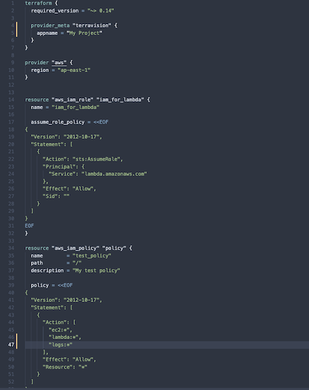
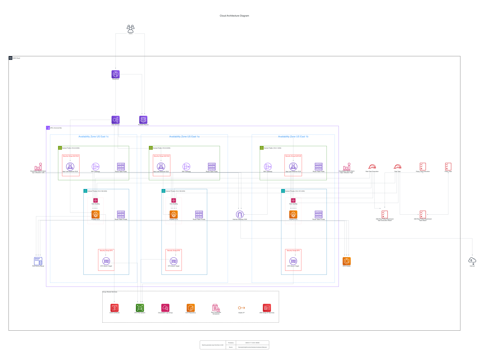
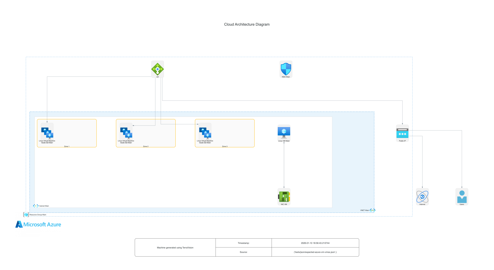
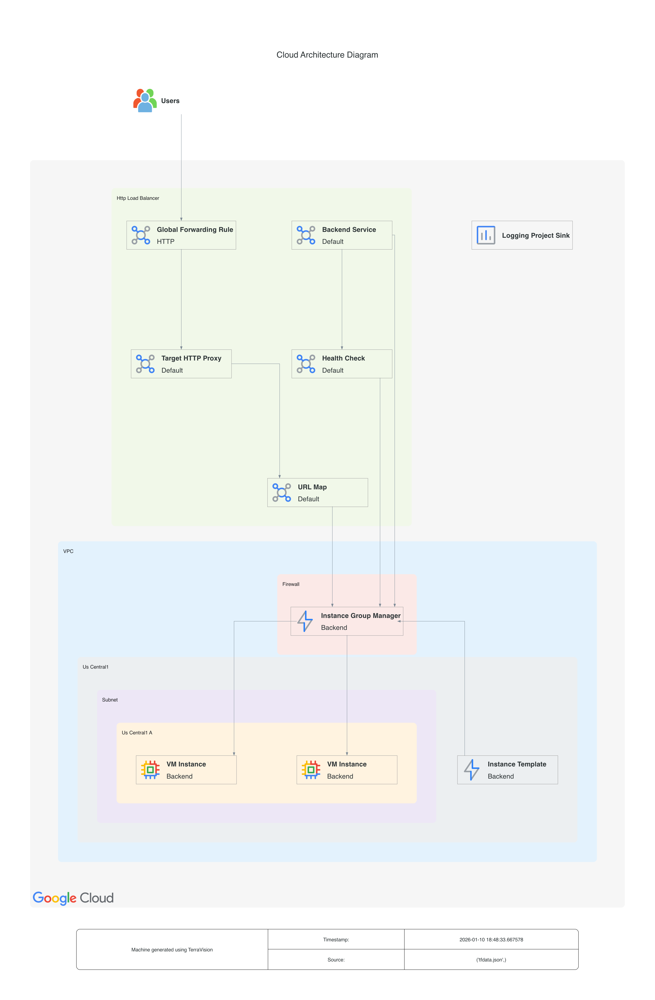
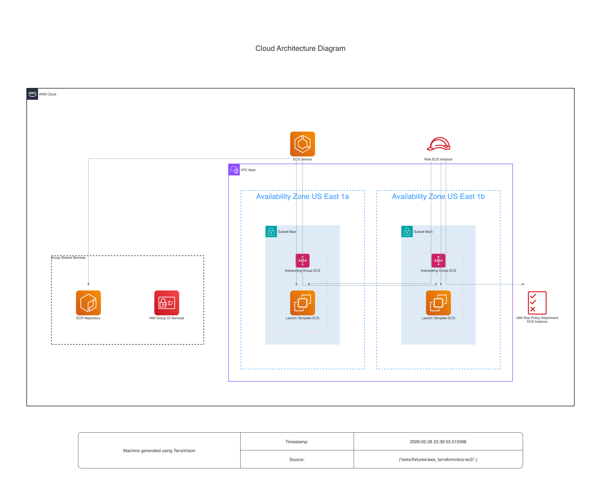
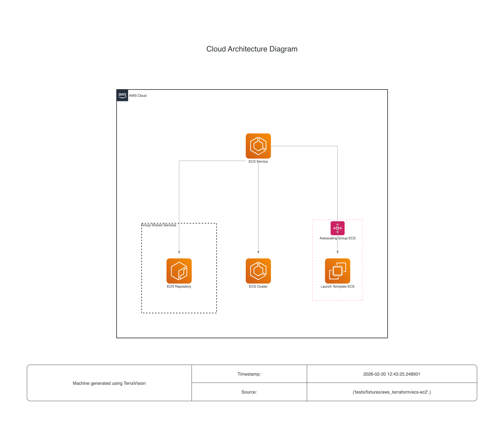
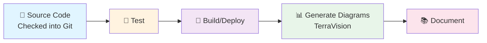

# TerraVision - Terraform Visualization tool and Architecture Diagram Generator

Visualise your Terraform code using official AWS/GCP/Azure design standards and icons to create solution architect grade architecture diagrams ready for audit, governance, team member and security reviews.

[](https://github.com/patrickchugh/terravision/actions/workflows/lint-and-test.yml)
[](https://pypi.org/project/terravision/)
[](https://pypi.org/project/terravision/)
[](https://pypi.org/project/terravision/)
[](https://github.com/patrickchugh/terravision/stargazers)
[](https://github.com/patrickchugh/terravision/network)
[](https://github.com/patrickchugh/terravision/issues)
[](https://github.com/patrickchugh/terravision/blob/main/LICENSE)
[](https://github.com/psf/black)

## Table of Contents

- [What is TerraVision?](#what-is-terravision)
- [Quick Start](#quick-start)
- [Key Features](#key-features)
- [Installation](#installation)
- [Basic Usage](#basic-usage)
- [Documentation](#documentation)
- [Supported Cloud Providers](#supported-cloud-providers)
- [Contributing](#contributing)
- [License](#license)

---

## What is TerraVision?

TerraVision automatically converts your Terraform code into professional grade cloud architecture diagrams. Quickly visualise any Terraform code to analyse what would be created in the cloud, AND keep your documentation in sync with your infrastructure. No more outdated diagrams!

**Turn this Terraform code:**



**Into these architecture diagrams:**

<a href="./images/architecture.png"></a>
<a href="./images/architecture-azure.dot.png"></a>
<a href="./images/architecture-gcp.dot.png"></a>

### Why TerraVision?

- ✅ **Always Up-to-Date**: Diagrams generated from actual Terraform code as the single source of truth
- ✅ **100% Client-Side**: No cloud access required, runs locally to keep your data secure
- ✅ **CI/CD Ready**: Automate diagram generation in a pipeline whenever a PR is merged
- ✅ **Free & Open Source**: No expensive diagramming tool licenses
- ✅ **Multi-Cloud**: Supports AWS, GCP, and Azure
- ✅ **Terragrunt Support**: Auto-detects single and multi-module Terragrunt projects

---

## Key Features

### 🎨 Professional Diagrams

- Industry-standard cloud provider icons (AWS, GCP, Azure)
- Automatic resource grouping (VPCs, subnets, security groups)
- Clean, readable layouts
- Multiple output formats (PNG, SVG, PDF, JPG, and [many more](#supported-output-formats))
- **Editable draw.io export** - open in draw.io, Lucidchart, or your favorite diagram editor
- **HTML viewer** - Browse a self-contained HTML to interactively explore your infrastructure and metadata, with animations on packet flow.

### 🤖 AI-Powered Annotations

- Generates AI-suggested connection labels, titles, and external actors
- Deterministic graph is never modified by the AI -- all suggestions go through an auditable annotation file
- Only metadata and summary graph sent to LLM, never your code
- Supports Ollama (local) and AWS Bedrock backends
 
### 📝 User Customizable Annotations

- Add custom labels and titles
- Include external resources not in Terraform
- Override automatic connections

### 🔄 CI/CD Integration

- GitHub Actions, GitLab CI, Jenkins support
- Show multiple environments using TF Variables to document variants of your infrastructure (e.g. prod vs dev)
- **Pre-generated plan mode**: Use `--planfile` and `--graphfile` to skip Terraform execution entirely — no cloud credentials needed in the diagram step
- **Terragrunt compatible**: Auto-detects `terragrunt.hcl` and uses the `terragrunt` CLI for init/plan — multi-module projects are merged automatically

### 🔒 Secure & Private

- No cloud credentials required
- Runs entirely on your local machine
- No external API calls (except optional AI features)

---

## Quick Start

### Option 1 - Docker

You can run `terravision` from within a Docker container. Pull the pre-built image from Docker Hub:

```sh
docker pull patrickchugh/terravision:latest
```

Or build it yourself from source:

```sh
git clone https://github.com/patrickchugh/terravision.git && cd terravision
docker build -t patrickchugh/terravision .
```

Then use it with any of your terraform files by mounting your local directory to the container:

If you pulled from Docker Hub, use `patrickchugh/terravision` as the image name. If you built locally, use `terravision` (or whatever tag you chose).

```sh
# Using Docker Hub image
$ docker run --rm -it -v $(pwd):/project patrickchugh/terravision draw --source /project/yourfiles/ --varfile /project/your.tfvars
$ docker run --rm -it -v $(pwd):/project patrickchugh/terravision draw --source https://github.com/your-repo/terraform-examples.git//mysubfolder/secondfolder/

# Using self-built image
$ docker run --rm -it -v $(pwd):/project terravision draw --source /project/yourfiles/ --varfile /project/your.tfvars
$ docker run --rm -it -v $(pwd):/project terravision draw --source https://github.com/your-repo/terraform-examples.git//mysubfolder/secondfolder/
```

The Docker image now includes `tfenv`, so you can optionally choose the Terraform version to install and use at runtime with `TFENV_TERRAFORM_VERSION` before `terravision` starts:

```sh
# Install and use a specific Terraform version through tfenv, then run terravision
$ docker run --rm -it -v $(pwd):/project -e TFENV_TERRAFORM_VERSION=1.9.8 patrickchugh/terravision draw --source /project/yourfiles/

# If TFENV_TERRAFORM_VERSION is omitted, the container invokes terravision directly
$ docker run --rm -it -v $(pwd):/project patrickchugh/terravision draw --source /project/yourfiles/
```

Depending on your cloud provider, you may need to pass your credentials so that OpenTofu/Terraform can run terraform plan commands

For example, for AWS:

```sh
# Example 1 Mount AWS Credentials folder
docker run -it --rm  -v $(pwd):/project  -v ~/.aws:/home/terravision/.aws:ro  patrickchugh/terravision draw --source /path/to/terraform_source
# Example 2 Pass credentials as environment variables
docker run -it --rm  -v $(pwd):/project  -e AWS_ACCESS_KEY_ID=your-access-key -e AWS_SECRET_ACCESS_KEY=your-secret-key  patrickchugh/terravision draw --source /path/to/terraform_source
```

### Option 2 - Local Install

Before installing TerraVision, ensure you have:

- **Python 3.10+** - [Download Python](https://www.python.org/downloads/)
- **Terraform 1.x** - [Install Terraform](https://developer.hashicorp.com/terraform/downloads)
- **Graphviz** - [Install Graphviz](https://graphviz.org/download/)
- **Git** - [Install Git](https://git-scm.com/downloads)
- **Ollama** (Optional - for local AI refinement) - [Install Ollama](https://ollama.ai/download)
- **Terragrunt** (Optional - for Terragrunt projects) - [Install Terragrunt](https://terragrunt.gruntwork.io/docs/getting-started/install/)

### Install TerraVision

```bash
pip install terravision # only if in a virtual env, if not you can use pipx install terravision instead
```

#### Draw.io Export

Draw.io export works out of the box on all platforms — no extra dependencies needed. Just use `--format drawio`:

```bash
terravision draw --source ./terraform --format drawio --outfile my-diagram
```

### Verify Terraform Setup

Before generating diagrams, ensure Terraform is working with `terraform init` and `terraform plan` 

TerraVision needs Terraform to successfully run `terraform plan` to parse your infrastructure. Note that whilst cloud credentials are required for TERRAFORM to validate resources and resolve functions, TerraVision itself never accesses your cloud account. Alternatively, use `--planfile` and `--graphfile` to provide pre-generated Terraform plan and graph outputs, bypassing Terraform execution entirely.

### Option 3 - Nix

If you have [Nix](https://nixos.org/download/) installed with flakes enabled, you can enter a development shell with `terravision` and all dependencies available:

```bash
git clone https://github.com/patrickchugh/terravision.git && cd terravision
nix develop
```

This provides `terravision`, `graphviz`, `terraform`, and `git` in your shell. You can also run it directly without cloning:

```bash
nix run github:patrickchugh/terravision -- draw --source /path/to/terraform --show
```

### Try It Out!

Generate your first diagram using our example Terraform code:

```bash

git clone https://github.com/patrickchugh/terravision.git
cd terravision

# Example 1: EKS cluster with fully managed nodes (auto)
terravision draw --source tests/fixtures/aws_terraform/eks_automode --show

# Example 2: Azure VM stack set
terravision draw --source tests/fixtures/azure_terraform/test_vm_vmss --show

# Example 3: From a public Git repository and only look at subfolder /aws/wordpress_fargate (note double slash)
terravision draw --source https://github.com/patrickchugh/terraform-examples.git//aws/wordpress_fargate --show
```

### Generate an Interactive HTML Diagram

The new `terravision visualise` command produces a self-contained interactive HTML file with clickable resource nodes, a metadata sidebar, search box, pan/zoom navigation, related-resources navigation, and animated edge flow. The HTML works fully offline — no internet connection or external resources required.

```bash
# Generate an interactive HTML diagram
terravision visualise --source ./terraform

# Auto-open the result in your default browser
terravision visualise --source ./terraform --show

# Custom output filename (.html appended automatically)
terravision visualise --source ./terraform --outfile my-architecture
```

**Interactive features in the generated HTML:**
- Click any resource icon or group container (VPC, subnet, security group) to see its Terraform metadata in a slide-in sidebar
- Search box to find resources by name and jump to them
- Pulsing yellow highlight + animated cyan flow trails on connected edges showing data flow direction (bidirectional edges flow both ways)
- Bold navy underlay on connected edges so they stand out where lines cross
- Related resources section showing both directly connected and same-type sibling resources (clickable for navigation)
- Copy-to-clipboard and expand-to-modal buttons on each metadata field
- Pan/zoom with `+`/`-`/`Fit` controls and mouse wheel
- Press `Escape` to close the detail panel

See the [`visualise` section in usage-guide.md](docs/usage-guide.md) for full details.

**That's it!** Your diagram is saved as `architecture.png` and automatically opened.

### Use Your Own Terraform Code

```bash
# Generate diagram from your Terraform directory
terravision draw --source /path/to/your/terraform/code
```

### Use Pre-Generated Terraform Plan (No Cloud Credentials Needed)

If you already have Terraform plan output (e.g. from a CI pipeline), you can generate diagrams without running Terraform:

```bash
# Step 1: Generate plan and graph files (in your Terraform environment)
terraform plan -out=tfplan.bin
terraform show -json tfplan.bin > plan.json
terraform graph > graph.dot

# Step 2: Generate diagram (no Terraform or cloud credentials needed)
terravision draw --planfile plan.json --graphfile graph.dot --source ./terraform
```

This is especially useful in CI/CD pipelines where Terraform runs in one step and diagram generation happens in another. See [CI/CD Integration](docs/cicd-integration.md) for examples.

### Use TerraVision simply as a drawing engine with a simple JSON dict
```bash
# Generate a JSON graph file as output (default file is architecture.json)
terravision graphdata --source tests/fixtures/aws_terraform/ecs-ec2
# Draw a diagram from a simple pre-existing JSON graph file
terravision draw --source tests/json/bastion-expected.json
```


---

## Installation for Developers / Power Users

**Detailed installation instructions**: See [docs/installation.md](docs/installation.md)

---

## Basic Usage

### Generate a Diagram

```bash
# From local Terraform directory
terravision draw --source ./terraform

# From Git repository
terravision draw --source https://github.com/user/repo.git

# With custom output format
terravision draw --source ./terraform --format svg --outfile my-architecture

# Open diagram automatically
terravision draw --source ./terraform --show
```

### AI-Powered Annotations

```bash
# Generate AI annotations with local Ollama
poetry run terravision draw --source ./terraform --ai-annotate ollama

# Generate AI annotations with AWS Bedrock
poetry run terravision draw --source ./terraform --ai-annotate bedrock
```

When `--ai-annotate <backend>` is used, TerraVision writes a `terravision.ai.yml` file (format 0.2) with AI-suggested edge labels, titles, external actors, and flow sequences. The deterministic graph is unchanged -- all AI suggestions flow through the annotation file. If a user-authored `terravision.yml` also exists, it takes precedence on conflicts.

The AI backend can also generate `flows` sections that describe request paths through your architecture. These render as numbered badges on nodes and edges, with a legend table at the bottom of the diagram:

```bash
# AI generates annotations including flow sequences
poetry run terravision draw --source ./terraform --ai-annotate bedrock
```

See [Annotations Guide](docs/annotations.md) for full details.

### Common Options

| Option        | Description                   | Example                    |
| ------------- | ----------------------------- | -------------------------- |
| `--source`    | Terraform code location       | `./terraform` or Git URL   |
| `--format`    | Output format (see [Supported Formats](#supported-output-formats)) | `png`, `svg`, `pdf`, `jpg`, etc. |
| `--outfile`   | Output filename               | `architecture` (default)   |
| `--workspace` | Terraform workspace           | `production`, `staging`    |
| `--varfile`   | Variable file                 | `prod.tfvars`              |
| `--planfile`  | Pre-generated plan JSON file  | `plan.json`                |
| `--graphfile` | Pre-generated graph DOT file  | `graph.dot`                |
| `--ai-annotate` | Generate AI annotations with specified backend | `ollama`, `bedrock` |
| `--simplified` | Simplified high-level view   | (flag)                     |
| `--show`      | Open diagram after generation | (flag)                     |
| `--debug`     | Enable debug output           | (flag)                     |

### Supported Output Formats

TerraVision supports all output formats provided by Graphviz, plus native draw.io export. Use the `--format` option to specify your desired format:

| Format | Description |
|--------|-------------|
| `png` | Portable Network Graphics (default) |
| `svg` | Scalable Vector Graphics - ideal for web |
| `pdf` | Portable Document Format - ideal for printing |
| `drawio` | **Editable diagram format** - open in draw.io, Lucidchart, or other diagram editors |
| `jpg` / `jpeg` | JPEG image format |
| `gif` | Graphics Interchange Format |
| `bmp` | Windows Bitmap |
| `eps` | Encapsulated PostScript |
| `ps` / `ps2` | PostScript |
| `tif` / `tiff` | Tagged Image File Format |
| `webp` | WebP image format |
| `dot` | Graphviz DOT source |
| `json` | Graphviz JSON format with layout info (different from `graphdata` output) |
| `xdot` | Extended DOT format with layout information |

For the complete list of Graphviz formats, see the [Graphviz Output Formats documentation](https://graphviz.org/docs/outputs/).

#### Editable Diagrams with draw.io Format

Generate diagrams you can edit in your favorite diagram editor:

```bash
terravision draw --source ./terraform --format drawio --outfile my-architecture
```

This creates a `.drawio` file that can be:
- Opened directly in [draw.io](https://app.diagrams.net/) (desktop or web)
- Imported into [Lucidchart](https://www.lucidchart.com/) (File → Import → select .drawio file)
- Edited in any diagram tool that supports the draw.io/mxGraph format

Perfect for adding annotations, adjusting layouts, or incorporating TerraVision output into existing documentation.

**Note**: `--format json` produces Graphviz's JSON format (includes layout coordinates). For TerraVision's simple graph dictionary format, use the `graphdata` command instead.

### Export Graph Data

```bash
# Export resource relationships as JSON
terravision graphdata --source ./terraform --outfile resources.json
```

**More examples**: See [docs/usage-guide.md](docs/usage-guide.md)

### Simplified Diagrams

Use the `--simplified` flag to generate a high-level overview that strips away networking infrastructure (VPCs, subnets, availability zones, security groups, route tables, etc.) and focuses on the core cloud services. Duplicate resource instances are collapsed into a single node, and connections are bridged through removed nodes to preserve the overall data flow.

```bash
# Detailed diagram (default) - shows full networking topology
terravision draw --source ./terraform

# Simplified diagram - high-level services only
terravision draw --source ./terraform --simplified
```

**Detailed view** (default) — includes VPCs, subnets, availability zones, IAM roles, and networking plumbing:

<a href="./images/architecture-detailed.dot.png"></a>

**Simplified view** (`--simplified`) — same infrastructure, focused on core services:

<a href="./images/architecture-simplified.dot.png"></a>

The `--simplified` flag works with both `draw` and `graphdata` commands and is supported across all cloud providers (AWS, GCP, Azure). It is useful for executive presentations, high-level documentation, or when the full networking detail makes diagrams hard to read.

---

## Documentation

### For Users

- **[Installation Guide](docs/installation.md)** - Detailed setup instructions
- **[Usage Guide](docs/usage-guide.md)** - Commands, options, and examples
- **[Annotations Guide](docs/annotations.md)** - Customize your diagrams
- **[CI/CD Integration](docs/cicd-integration.md)** - Automate diagram generation
- **[Troubleshooting](docs/troubleshooting.md)** - Common issues and solutions

### For Developers

- **[Resource Handler Guide](docs/resource-handler-guide.md)** - Handler architecture
- **[Contributing Guide](CONTRIBUTING.md)** - How to contribute
- **[Developer Guide](docs/developer-guide.md)** - Development setup

### Advanced Topics

- **[AI-Powered Refinement](docs/AI_REFINEMENT.md)** - Using AI to improve diagrams
- **[Performance Optimization](docs/PERFORMANCE.md)** - Tips for large projects

---

## Supported Cloud Providers

| Provider         | Status             | Resources Supported |
| ---------------- | ------------------ | ------------------- |
| **AWS**          | ✅ Full Support    | 200+ services       |
| **Google Cloud** | 🔄 Partial Support | Core Services       |
| **Azure**        | 🔄 Partial Support | Core services       |

---

## CI/CD Integration

### Pipeline Workflow


```mermaid
graph LR
    A["📝 Source Code<br/>Checked into Git"] --> B["🧪 Test"]
    B --> C["🔨 Build/Deploy"]
    C --> D["📊 Generate Diagrams<br/>TerraVision"]
    D --> E["📚 Document"]

    style A fill:#e1f5ff
    style B fill:#fff3e0
    style C fill:#f3e5f5
    style D fill:#e8f5e9
    style E fill:#fce4ec
```

### GitHub Actions

Use the official [TerraVision Action](https://github.com/patrickchugh/terravision-action):

```yaml
# .github/workflows/architecture-diagrams.yml
name: Update Architecture Diagrams

on:
  push:
    branches: [main]
    paths: ['**.tf', '**.tfvars']

jobs:
  generate-diagrams:
    runs-on: ubuntu-latest
    permissions:
      id-token: write
      contents: write
    steps:
      - uses: actions/checkout@v4

      - uses: hashicorp/setup-terraform@v3

      - name: Configure AWS credentials
        uses: aws-actions/configure-aws-credentials@v4
        timeout-minutes: 2
        with:
          role-to-assume: arn:aws:iam::1xxxxxxx8090:role/githubactions
          role-session-name: ghasession
          aws-region: us-east-1

      - uses: patrickchugh/terravision-action@v2
        with:
          source: .
          format: png

      - name: Commit Diagrams
        run: |
          git config user.name "github-actions[bot]"
          git config user.email "github-actions[bot]@users.noreply.github.com"
          git add architecture.dot.*
          git commit -m "Update architecture diagrams [skip ci]" || exit 0
          git push

```
* AWS Example - You will need an IAM role the action can assume and a Trust policy granting github to assume it

### Without Cloud Credentials (Pre-Generated Plan)

If Terraform runs in a separate pipeline step, pass the plan and graph files to TerraVision:

```yaml
# .github/workflows/architecture-diagrams.yml
name: Update Architecture Diagrams

on:
  push:
    branches: [main]
    paths: ['**.tf', '**.tfvars']

jobs:
  generate-diagrams:
    runs-on: ubuntu-latest
    steps:
      - uses: actions/checkout@v4
      - uses: hashicorp/setup-terraform@v3

      - name: Configure AWS credentials
        uses: aws-actions/configure-aws-credentials@v4
        with:
          role-to-assume: arn:aws:iam::123456789012:role/terraform-role
          aws-region: us-east-1

      - name: Terraform Plan
        run: |
          cd infrastructure
          terraform init
          terraform plan -out=tfplan.bin
          terraform show -json tfplan.bin > plan.json
          terraform graph > graph.dot

      - name: Generate Diagram (no credentials needed)
        run: |
          pip install terravision
          terravision draw \
            --planfile infrastructure/plan.json \
            --graphfile infrastructure/graph.dot \
            --source ./infrastructure \
            --format png
```

### GitLab CI / Jenkins / Other

Use the Docker image directly — no additional setup needed:

```yaml
# GitLab CI example
generate-diagram:
  image: patrickchugh/terravision:latest
  script:
    - terravision draw --source ./infrastructure --outfile architecture --format png
  artifacts:
    paths:
      - architecture.png
```

**Full CI/CD guide (GitHub, GitLab, Jenkins, Azure DevOps, generic)**: See [docs/cicd-integration.md](docs/cicd-integration.md)

---

## Contributing

We welcome contributions! See [CONTRIBUTING.md](docs/CONTRIBUTING.md) for:

- Code of conduct
- Development setup
- Pull request process
- Coding standards

---

## Support

- **Issues**: [GitHub Issues](https://github.com/patrickchugh/terravision/issues)
- **Discussions**: [GitHub Discussions](https://github.com/patrickchugh/terravision/discussions)
- **Documentation**: [docs/](docs/)

---

## License

Refer to LICENSE text file

---

## Acknowledgments

TerraVision uses:

- [Graphviz](https://graphviz.org/) for diagram rendering
- [Terraform](https://www.terraform.io/) for infrastructure parsing
- [Terragrunt](https://terragrunt.gruntwork.io/) for multi-module infrastructure orchestration
- Cloud provider icons from official sources
