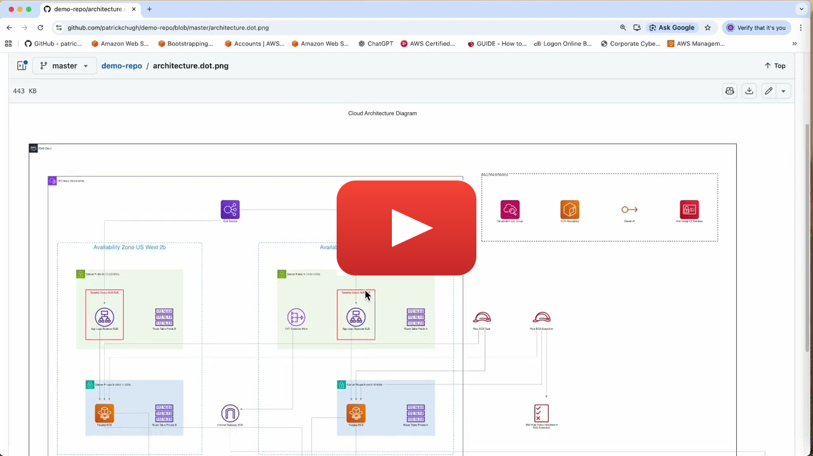

# TerraVision

<!-- mcp-name: io.github.patrickchugh/terravision -->

**Turn Terraform or JSON files into professional cloud architecture diagrams with the official AWS, Azure and GCP icons**

[](https://github.com/patrickchugh/terravision/actions/workflows/lint-and-test.yml)
[](https://pypi.org/project/terravision/)
[](https://pypi.org/project/terravision/)
[](https://pypi.org/project/terravision/)
[](https://github.com/patrickchugh/terravision/stargazers)
[](https://github.com/patrickchugh/terravision/blob/main/LICENSE)
[](https://github.com/psf/black)

**📖 [Full documentation site →](https://patrickchugh.github.io/terravision/)**

---

## Watch a 4-Minute Intro

[](https://youtu.be/bTrWHBI2mF4)

---
## What is TerraVision?

TerraVision automatically converts your Terraform code, or a plain JSON graph of Terraform resource names, into professional-grade cloud architecture diagrams using the official AWS, GCP, and Azure icon sets. Your diagrams stay in sync with your infrastructure — no more outdated Visio, draw.io or Lucidchart files.

Most diagram tools that AI assistants reach for (Mermaid, PlantUML, hand-drawn SVG) produce boxes and arrows. TerraVision produces the diagram a cloud architect would draw: real provider icons, VPCs and subnets nested correctly, resource groups, regions and zones. It runs entirely on your machine, needs no cloud credentials, and outputs PNG, SVG, PDF or an editable draw.io file.

## Why TerraVision?

- ✅ **JSON graph input** — describe an architecture in a few lines of JSON and render it, resources match Terraform names so no need to learn a custom DSL ([Graph Format](docs/graph-format.md))
- ✅ **Always up-to-date** — diagrams generated directly from your Terraform code
- ✅ **100% client-side** — no cloud access required, runs locally, your code never leaves your machine
- ✅ **CI/CD ready** — automate diagram updates on every PR merge
- ✅ **Free & open source** — no expensive diagramming tool licenses
- ✅ **Multi-cloud** — AWS (full), GCP, and Azure (core services)
- ✅ **Interactive HTML output** — clickable nodes, pan/zoom, search, animated data flow
- ✅ **Editable draw.io export** — open in draw.io, Lucidchart, or any mxGraph editor
- ✅ **Optional AI annotations** — labels, titles, and flow sequences from Ollama (local) or AWS Bedrock
- ✅ **Terragrunt compatible** — auto-detects single- and multi-module Terragrunt projects
- ✅ **MCP server and agent skill** — let AI agents generate diagrams from a JSON graph or your Terraform, [see the guide](docs/mcp-server.md)

---

## Supported Cloud Providers

| Provider         | Status          | Resource types |
| ---------------- | --------------- | -------------- |
| **AWS**          | ✅ Full support | 385 types      |
| **Google Cloud** | ✅ Full support | 264 types      |
| **Azure**        | ✅ Full support | 245 types      |

Full list: [Node types](docs/node-types.md).

---

## Quick Start

### Install

```bash
pipx install terravision   # or: uv tool install terravision
                           # or: pip install terravision in a virtual env
```

You also need **Python 3.11+** (uv installs one for you), **Graphviz** and **Git**, plus **Terraform 1.x** (or OpenTofu) when drawing from Terraform code; JSON graphs don't need it. See the [Installation Guide](https://patrickchugh.github.io/terravision/installation/) for platform-specific instructions, Docker, and Nix.

### Option 1 - Diagram from JSON (no Terraform needed)

Describe the architecture as nodes and connections. AWS is shown here; expand the Azure and GCP examples below.

```json
{
  "tv_aws_users.users": ["aws_cloudfront_distribution.cdn"],
  "aws_cloudfront_distribution.cdn": ["aws_s3_bucket.static_site", "aws_alb.api"],
  "aws_vpc.main": ["aws_subnet.public~1", "aws_subnet.private~1"],
  "aws_subnet.public~1": ["aws_alb.api"],
  "aws_subnet.private~1": ["aws_lambda_function.orders"],
  "aws_alb.api": ["aws_lambda_function.orders"],
  "aws_lambda_function.orders": ["aws_dynamodb_table.orders", "aws_sqs_queue.events"]
}
```

<details>
<summary><b>Azure example</b></summary>

```json
{
  "tv_azurerm_users.users": ["azurerm_cdn_frontdoor_profile.edge"],
  "azurerm_cdn_frontdoor_profile.edge": ["azurerm_linux_web_app.api"],
  "azurerm_resource_group.app": ["azurerm_virtual_network.main", "azurerm_mssql_database.orders", "azurerm_servicebus_queue.events", "azurerm_key_vault.secrets"],
  "azurerm_virtual_network.main": ["azurerm_subnet.app"],
  "azurerm_subnet.app": ["azurerm_linux_web_app.api"],
  "azurerm_linux_web_app.api": ["azurerm_mssql_database.orders", "azurerm_servicebus_queue.events", "azurerm_key_vault.secrets"]
}
```

</details>

<details>
<summary><b>GCP example</b></summary>

```json
{
  "tv_gcp_users_icon.users": ["google_compute_global_forwarding_rule.lb"],
  "google_compute_global_forwarding_rule.lb": ["google_cloud_run_v2_service.api"],
  "google_cloud_run_v2_service.api": ["google_sql_database_instance.orders", "google_pubsub_topic.events", "google_storage_bucket.assets"],
  "google_pubsub_topic.events": ["google_cloudfunctions2_function.worker"]
}
```

</details>

Render it:

```bash
terravision draw --source architecture.tvg.json --format svg
```

Each key is `<terraform_resource_type>.<name>`; each value is what it connects to or contains. That is the whole format. Full spec, schema and more examples: [Graph Format](docs/graph-format.md). Works for AWS (`aws_*`), Azure (`azurerm_*`) and GCP (`google_*`).

**Using an AI assistant?** Install the [TerraVision skill](skills/terravision-cloud-diagrams) and the [MCP server](docs/mcp-server.md) together as a plugin, then ask for a cloud architecture diagram as usual:

```bash
# Claude Code
claude plugin marketplace add patrickchugh/terravision
claude plugin install terravision-cloud-diagrams@terravision

# OpenAI Codex CLI
codex plugin marketplace add https://github.com/patrickchugh/terravision
codex plugin add terravision-cloud-diagrams@terravision

# Gemini CLI
gemini extensions install https://github.com/patrickchugh/terravision
```

Other agents that read skills (Cursor, Copilot) can use the [skill folder](skills/terravision-cloud-diagrams) directly, and any MCP client can run the [MCP server](docs/mcp-server.md), whose `render_graph` tool takes this JSON directly. For agents reading docs, [llms.txt](https://patrickchugh.github.io/terravision/llms.txt) is a plain-text index of the docs, and [llms-full.txt](https://patrickchugh.github.io/terravision/llms-full.txt) adds the full node-type reference.

### Option 2 - Generate your  diagram from Terraform

```bash
git clone https://github.com/patrickchugh/terravision.git
cd terravision

# EKS cluster example
terravision draw --source tests/fixtures/aws_terraform/eks_automode --show

# Azure VM scale set
terravision draw --source tests/fixtures/azure_terraform/test_vm_vmss --show

# From a public Git repo (note the // for subfolder)
terravision draw --source https://github.com/patrickchugh/terraform-examples.git//aws/wordpress_fargate --show
```

That's it — your diagram is saved as `architecture-aws.dot.png` (the provider is appended to the name) and opens automatically.

The diagram is derived from `terraform plan`, so it shows what the code actually deploys: conditionals, `count`, `for_each` and modules are resolved. Eraser and friends draw what the AI imagines; TerraVision proves what the code deploys.

## Generate an interactive HTML diagram

```bash
terravision visualise --source ./path-to-your-terraform --show
```

Click any resource to see its Terraform metadata, search resources, pan/zoom, and watch animated data flow on edges. The HTML is a single self-contained file that works fully offline.

---

## Try the Interactive Demos

Click any of these to see the interactive HTML output TerraVision produces:

- 🟧 **[AWS demo](https://patrickchugh.github.io/terravision/demo-aws.html)** — Wordpress on ECS Fargate with CloudFront, RDS, EFS
- 🟦 **[Azure demo](https://patrickchugh.github.io/terravision/demo-azure.html)** — VM scale set with load balancer and VNet
- 🟩 **[GCP demo](https://patrickchugh.github.io/terravision/demo-gcp.html)** — Core GCP networking and compute

---

## Basic Usage

### Generate a diagram

```bash
# From a local directory
terravision draw --source ./path-to-your-terraform

# From a Git repository
terravision draw --source https://github.com/user/repo.git

# Custom format and filename
terravision draw --source ./path-to-your-terraform --format svg --outfile my-architecture

# Editable draw.io file
terravision draw --source ./path-to-your-terraform --format drawio --outfile my-architecture
```

### Use a pre-generated Terraform plan (no cloud credentials needed)

```bash
# Step 1: in your Terraform environment
terraform plan -out=tfplan.bin
terraform show -json tfplan.bin > plan.json
terraform graph > graph.dot

# Step 2: diagram generation, no Terraform or cloud access required
terravision draw --planfile plan.json --graphfile graph.dot --source ./path-to-your-terraform
```

### AI-powered annotations (optional)

```bash
terravision draw --source ./path-to-your-terraform --ai-annotate ollama   # local LLM (no data leaves your machine)
terravision draw --source ./path-to-your-terraform --ai-annotate bedrock  # AWS Bedrock via boto3 (uses your AWS credentials)
terravision draw --source ./path-to-your-terraform --ai-annotate restapi  # any OpenAI-compatible endpoint (OpenAI, LiteLLM, vLLM, ...)
```

Only metadata and the summary graph are sent to the LLM — never your `.tf` source. The `bedrock` backend authenticates via the standard AWS credential chain (no infrastructure to deploy); `restapi` is configured via `TV_RESTAPI_URL`, `TV_RESTAPI_KEY`, and `TV_RESTAPI_MODEL`. See the [Annotations Guide](https://patrickchugh.github.io/terravision/annotations/) and [AI-Powered Annotations](https://patrickchugh.github.io/terravision/usage-guide/#ai-powered-annotations) for the full configuration.

### Simplified view

```bash
terravision draw --source ./path-to-your-terraform --simplified
```

Strips VPCs, subnets, and networking plumbing. Great for executive presentations.

### Common options

``terravision --help`` shows full help text details. 

| Option          | Description                                                                | Example                             |
| --------------- | -------------------------------------------------------------------------- | ----------------------------------- |
| `--source`      | Terraform directory or Git URL                                             | `./path-to-your-terraform`                       |
| `--format`      | Output format: `png`, `svg`, `pdf`, `drawio`, [and more][formats]          | `svg`                               |
| `--outfile`     | Output filename                                                            | `my-architecture`                   |
| `--workspace`   | Terraform workspace                                                        | `production`                        |
| `--varfile`     | Variable file (repeatable)                                                 | `prod.tfvars`                       |
| `--planfile`    | Pre-generated plan JSON                                                    | `plan.json`                         |
| `--graphfile`   | Pre-generated graph DOT                                                    | `graph.dot`                         |
| `--ai-annotate` | AI annotation backend                                                      | `ollama`, `bedrock`, `restapi`      |
| `--simplified`  | High-level view (no networking)                                            | (flag)                              |
| `--show`        | Open after generation                                                      | (flag)                              |

[formats]: https://patrickchugh.github.io/terravision/usage-guide/#output-formats

---

## Documentation

The complete documentation lives at **[patrickchugh.github.io/terravision](https://patrickchugh.github.io/terravision/)**.

**For users:**
- [Installation Guide](docs/installation.md)
- [Usage Guide](docs/usage-guide.md)
- [Annotations Guide](docs/annotations.md)
- [CI/CD Integration](docs/cicd-integration.md)
- [MCP Server Guide](docs/mcp-server.md)
- [llms.txt](https://patrickchugh.github.io/terravision/llms.txt) (docs index for AI agents)
- [FAQ](docs/faq.md)
- [Troubleshooting](docs/troubleshooting.md)

**For contributors:**
- [Contributing Guide](docs/CONTRIBUTING.md)
- [Developer Guide](docs/developer-guide.md)
- [Resource Handler Guide](docs/resource-handler-guide.md)
- [Project Constitution](docs/constitution.md)

---

## FAQ

Common questions — cloud credentials, LLM data privacy, offline use, Terragrunt, output formats, and more — are answered in the **[FAQ on the documentation site](https://patrickchugh.github.io/terravision/faq/)**.

---

## Contributing

Contributions are very welcome. See [CONTRIBUTING.md](docs/CONTRIBUTING.md) for development setup, coding standards, and the PR process.

## Support

- **Issues**: [GitHub Issues](https://github.com/patrickchugh/terravision/issues)
- **Discussions**: [GitHub Discussions](https://github.com/patrickchugh/terravision/discussions)
- **Documentation**: [patrickchugh.github.io/terravision](https://patrickchugh.github.io/terravision/)

## License

See [LICENSE](LICENSE).

## Acknowledgments

- [Graphviz](https://graphviz.org/) — diagram rendering
- [Terraform](https://www.terraform.io/) — infrastructure parsing
- [Terragrunt](https://terragrunt.gruntwork.io/) — multi-module orchestration
- Cloud provider icons from official AWS, GCP, and Azure icon sets
