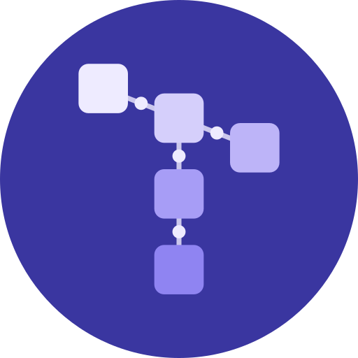
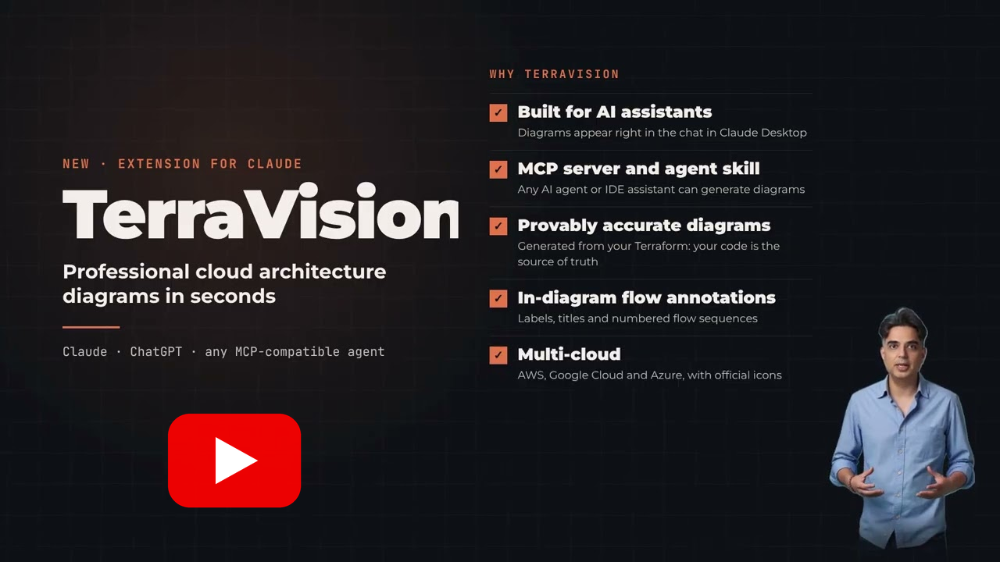

#  TerraVision

<!-- mcp-name: io.github.patrickchugh/terravision -->

**Professional cloud architecture diagrams in official AWS, Azure and GCP style, from a description in Claude or ChatGPT or from your Terraform**

[](https://github.com/patrickchugh/terravision/actions/workflows/lint-and-test.yml)
[](https://pypi.org/project/terravision/)
[](https://pypi.org/project/terravision/)
[](https://pypi.org/project/terravision/)
[](https://github.com/patrickchugh/terravision/stargazers)
[](https://github.com/patrickchugh/terravision/blob/main/LICENSE)
[](https://github.com/psf/black)

**📖 [Full documentation site →](https://patrickchugh.github.io/terravision/)**

TerraVision is a free, open-source **cloud architecture diagram generator** for AWS, Azure and Google Cloud that works in both directions: **design to code** (describe it to your AI assistant, get the diagram, then the Terraform) and **code to diagram** (draw what your Terraform deploys).

Ask your AI assistant for a cloud architecture diagram, in plain words, and get the diagram a cloud architect would draw: the official AWS, Azure and GCP icons, with every resource in its VPC, subnet, zone or resource group. From a description, from your Terraform code, or the other way round, with the Terraform written from the diagram. TerraVision runs on your own computer and needs no cloud access.

---

## Watch the 90-Second Intro

[](https://youtu.be/BbXWR-v_Dl0)

---

## Gallery

The same three-tier design on each cloud, then a flagship for each. Every example comes with the prompt and the source file: **[see the full gallery of 12 →](https://patrickchugh.github.io/terravision/gallery/)**

<table>
<tr>
<td width="33%" align="center"><a href="https://patrickchugh.github.io/terravision/gallery/#aws-three-tier-web-application-architecture-diagram"></a><br><b>AWS</b> three-tier web app</td>
<td width="33%" align="center"><a href="https://patrickchugh.github.io/terravision/gallery/#azure-three-tier-web-application-architecture-diagram"></a><br><b>Azure</b> three-tier web app</td>
<td width="33%" align="center"><a href="https://patrickchugh.github.io/terravision/gallery/#google-cloud-three-tier-web-application-architecture-diagram"></a><br><b>Google Cloud</b> three-tier web app</td>
</tr>
<tr>
<td width="33%" align="center"><a href="https://patrickchugh.github.io/terravision/gallery/#amazon-eks-karpenter-architecture-diagram"></a><br><b>AWS</b> EKS with Karpenter</td>
<td width="33%" align="center"><a href="https://patrickchugh.github.io/terravision/gallery/#azure-hub-and-spoke-architecture-diagram"></a><br><b>Azure</b> hub-and-spoke landing zone</td>
<td width="33%" align="center"><a href="https://patrickchugh.github.io/terravision/gallery/#google-cloud-gke-architecture-diagram"></a><br><b>Google Cloud</b> GKE with Private Service Connect</td>
</tr>
</table>

More in the gallery: [AWS serverless event-driven](https://patrickchugh.github.io/terravision/gallery/#aws-serverless-event-driven-architecture-diagram) · [AWS data lake](https://patrickchugh.github.io/terravision/gallery/#aws-data-lake-architecture-diagram) · [AWS multi-region failover](https://patrickchugh.github.io/terravision/gallery/#aws-multi-region-failover-architecture-diagram) · [AWS multi-account network](https://patrickchugh.github.io/terravision/gallery/#aws-multi-account-network-architecture-diagram) · [Azure AKS](https://patrickchugh.github.io/terravision/gallery/#azure-aks-architecture-diagram) · [Google Cloud data pipeline](https://patrickchugh.github.io/terravision/gallery/#google-cloud-data-pipeline-architecture-diagram)

---

## Get started in Claude or ChatGPT

TerraVision installs as an extension in **Claude Desktop** and a plugin in the **ChatGPT desktop app**, where the diagram appears right in the chat. It also works in Claude Code, Codex CLI, GitHub Copilot, Cursor and any other MCP client.

### 1. Install the prerequisites (once)

TerraVision needs **Graphviz** (to draw) and **Git**. **uv** runs TerraVision for Claude Code, Codex, Antigravity CLI and other MCP clients; Claude Desktop brings its own on Windows and macOS, so skip it there. **Terraform** is only needed to draw from Terraform code.

<details open>
<summary><b>macOS</b></summary>

With [Homebrew](https://brew.sh):

```bash
brew install graphviz git
brew install uv                        # not needed for Claude Desktop
brew install hashicorp/tap/terraform   # optional: to draw from Terraform code
```

</details>

<details>
<summary><b>Windows</b></summary>

In PowerShell:

```powershell
winget install --id Graphviz.Graphviz -e
winget install --id Git.Git -e
winget install --id astral-sh.uv -e    # not needed for Claude Desktop
winget install --id Hashicorp.Terraform -e   # optional: to draw from Terraform code
```

Then open a **new** terminal, and restart your AI app, so they see the new programs.

</details>

<details>
<summary><b>Linux (Debian, Ubuntu)</b></summary>

```bash
sudo apt install graphviz git
# Ubuntu 26.04 and later only (also Debian 14 "forky"/testing).
# Skip on older releases such as Ubuntu 24.04: graphviz already includes it.
sudo apt install libgvplugin-neato-layout8

curl -LsSf https://astral.sh/uv/install.sh | sh   # Claude Desktop on Linux needs uv pre-installed

# optionally install terraform, to draw from Terraform code: HashiCorp's apt repository
wget -O- https://apt.releases.hashicorp.com/gpg | sudo gpg --dearmor -o /usr/share/keyrings/hashicorp-archive-keyring.gpg
echo "deb [signed-by=/usr/share/keyrings/hashicorp-archive-keyring.gpg] https://apt.releases.hashicorp.com $(lsb_release -cs) main" | sudo tee /etc/apt/sources.list.d/hashicorp.list
sudo apt update && sudo apt install terraform
```

Other distributions: [HashiCorp's install guide](https://developer.hashicorp.com/terraform/install).

</details>

**Can't use a package manager?** Without admin rights, or when your organisation's Artifactory or Nexus doesn't carry these packages, download each one from its own site instead: [Graphviz](https://graphviz.org/download/) (on Windows, the ZIP archive unpacks into any folder without admin rights; on macOS and Linux, build it from source into your home folder: [steps](https://patrickchugh.github.io/terravision/installation/#graphviz)), [Git](https://git-scm.com/downloads) (Windows has a portable edition), [uv](https://docs.astral.sh/uv/getting-started/installation/) (its installer needs no admin rights) and [Terraform](https://developer.hashicorp.com/terraform/install) (a single program to unzip). Then add each one's folder to your PATH ([how, on Windows](https://patrickchugh.github.io/terravision/installation/#graphviz)) and restart your AI app, or ask your IT team to install them.

### 2. Connect your assistant

**Claude Desktop:** 

Download `terravision-<version>.mcpb` from the [latest release](https://github.com/patrickchugh/terravision/releases/latest) and open it (or drag it into **Settings → Extensions**). Diagrams appear right in the chat, with buttons to open the image, edit it in draw.io, show it in its folder and see its source.

**Claude Code** (terminal, VS Code or JetBrains):

```bash
claude plugin marketplace add patrickchugh/terravision
claude plugin install terravision-cloud-diagrams@terravision
```

Then start a new Claude Code session. Diagrams are saved in a `diagrams` folder in your project.

The very first start downloads and installs TerraVision, which can take longer than Claude Code waits. If `/mcp` shows TerraVision failed to connect, choose **Reconnect**. To avoid it, install it ahead of time: `uvx --from "terravision[mcp]" terravision --version`.

**ChatGPT desktop app and OpenAI Codex CLI** (the desktop app includes Codex and uses the same plugins):

In the desktop app, go to Settings, add the marketplace `https://github.com/patrickchugh/terravision`, then select `terravision-cloud-diagrams`. For the CLI:

```bash
codex plugin marketplace add https://github.com/patrickchugh/terravision
codex plugin add terravision-cloud-diagrams@terravision
```

**Google Antigravity CLI** (`agy`, which replaced Gemini CLI):

```bash
agy mcp add terravision -- uvx --from "terravision[mcp]" terravision mcp --output-dir /path/for/diagrams
```

Gemini CLI stopped working for personal Google accounts on 18 June 2026; with a Gemini Code Assist Standard or Enterprise licence or a paid API key it still runs, and installs TerraVision with `gemini extensions install https://github.com/patrickchugh/terravision`.

**VS Code with GitHub Copilot, Cursor and other MCP clients:** 

Add TerraVision as an MCP server that runs `uvx --from "terravision[mcp]" terravision mcp --output-dir <folder for diagrams>`. The [setup guide](https://patrickchugh.github.io/terravision/ai-assistants/) has the configuration for each.

**Any other agent (Cursor, GitHub Copilot, Codex, Claude Code and more)** with the [skills CLI](https://skills.sh):

```bash
npx skills add patrickchugh/terravision
```

This installs the skill only: the instructions that teach the assistant the TerraVision graph format. It does not install TerraVision itself. The assistant then runs the `terravision` command, so [install TerraVision](#install) and the [prerequisites](#1-install-the-prerequisites-once) first. It does not include the MCP server, so there is no diagram view in the chat; for that, use the Claude Desktop extension or the Claude Code / ChatGPT plugin above. The installer needs Node.js, which provides `npx`.

### 3. Ask for a diagram (or code)

| You have | Ask something like | You get |
|---|---|---|
| An idea | *"Draw an AWS three-tier app: React on CloudFront, ECS Fargate behind an ALB in two AZs, SQL Server on RDS Multi-AZ"* | The diagram (PNG, SVG, editable draw.io) and its graph. Refine it by asking: *"add ElastiCache"*, *"show how a request flows through it"* |
| Terraform code, local or on GitHub but no VERIFIED diagram | *"Draw the architecture of the Terraform in ./infra"* or *"Show me a cloud architecture diagram of https://github.com/patrickchugh/testcase-bastion//examples"* | A diagram of what `terraform plan` says the code deploys |
| A diagram you like generated from TerraVision | *"Write the Terraform for this architecture"* | Terraform for the resources, zones and connections, with the diagram's flows and labels kept (quality depends on model used) |
| Terraform with an existing TerraVision diagram in a repository | *"Keep this diagram up to date in CI"* | A workflow that redraws the diagram whenever the Terraform changes |

The first diagram takes a little longer while TerraVision installs itself. If anything is missing, the assistant says what to install. To check at any time, ask: *"Is TerraVision set up correctly?"*

The full guide, with more example prompts: **[Use TerraVision with AI assistants](https://patrickchugh.github.io/terravision/ai-assistants/)**.

---

## Keep diagrams current in CI/CD

Point the [TerraVision GitHub Action](https://github.com/patrickchugh/terravision-action) at your Terraform, and the diagram redraws itself on every change:

```yaml
- uses: hashicorp/setup-terraform@v3
- uses: patrickchugh/terravision-action@v2
  with:
    source: ./infrastructure
    outfile: docs/architecture
    format: both
```

A `terravision.yml` next to the Terraform adds the title, numbered flows and connection labels to every version. GitLab, Jenkins, Azure DevOps and others: [CI/CD Integration](https://patrickchugh.github.io/terravision/cicd-integration/).

---

## Why TerraVision?

- ✅ **Built for AI assistants** — marketplace extensions and plugins for Claude, Codex, Gemini, Copilot and Cursor; diagrams appear right in the chat in Claude Desktop and the ChatGPT desktop app ([guide](https://patrickchugh.github.io/terravision/ai-assistants/))
- ✅ **Provably Accurate diagrams** — accurate diagrams generated directly from your Terraform code so your code is the source of truth - what you see is what you get
- ✅ **MCP server and agent skill** — let any AI agent, or an assistant in an IDE such as Visual Studio Code, generate diagrams from a JSON graph or your Terraform ([guide](docs/mcp-server.md))
- ✅ **In Diagram flow annotations** — labels, titles, and flow sequences supported via YAML or generated by AI models including Ollama (running local) and AWS Bedrock
- ✅ **JSON graph input** — describe an architecture in a few lines of JSON and render it, resources match Terraform names so no need to learn a custom DSL ([Graph Format](docs/graph-format.md))
- ✅ **100% client-side** — designed with security in mind; no cloud access required, runs locally, your code never leaves your machine
- ✅ **CI/CD ready** — automate diagram updates on every PR merge
- ✅ **Free & open source** — no expensive diagramming tool licenses
- ✅ **Multi-cloud** — AWS, Google Cloud (GCP) and Azure supported
- ✅ **Interactive HTML output** — clickable nodes, pan/zoom, search, animated data flow
- ✅ **Editable draw.io export** — open in draw.io, Lucidchart, or any mxGraph editor
- ✅ **Terragrunt compatible** — auto-detects single- and multi-module Terragrunt projects

---

## How it compares

| | TerraVision | Manual tools<br>(draw.io, Lucidchart, Visio) | AI workspaces<br>(Eraser) | Diagram as code<br>(Mermaid, D2, Python Diagrams) | Live cloud scanners<br>(e.g. Cloudcraft) |
|---|---|---|---|---|---|
| Draw from a plain-English description | ✅ inside the assistant you already use (Claude, ChatGPT, Copilot) |  only if your organisation approves third-party models | ✅ | |  |
| Draw from Terraform | ✅ built from `terraform plan`, client side |  |  AI interprets the files you paste (potentially exposes code & secrets) |  |   |
| Draw an environment you have no access to, or one not built yet | ✅ from the code and a variables file: `--varfile prod.tfvars` draws prod, `--varfile dev.tfvars` draws dev, with no access to the target account or its state |  drawn by hand from documents |  from code you paste |  written by hand |  draws only an account it can connect to |
| Write the Terraform for a design | ✅ by your assistant, checked by redrawing the code AI writes |  Lucidchart beta, AWS only, paid add-on |  |  |  |
| Official icons and VPC, subnet, zone grouping conventions | ✅ built in |  icon libraries; correct grouping is up to you |  icons, generic groups |  |  |
| Stays current automatically | ✅ redrawn from the code in CI |  |  repository sync |   | ✅ follows the live account |
|High Security - No access to your cloud account or upload of your code | ✅ | ✅ |  | ✅ |  |
| Price | Free, open source | Free to paid | Free tier, paid plans | Free, open source | Paid |

Already draw by hand? Generate the first version with TerraVision, then polish the exported file in draw.io or Lucidchart. Full comparison: [TerraVision vs draw.io, Lucidchart, Eraser, Mermaid and others](https://patrickchugh.github.io/terravision/alternatives/).

---

## Supported Cloud Providers

| Provider         | Status          | Resource types |
| ---------------- | --------------- | -------------- |
| **AWS**          | ✅ Full support | 385 types      |
| **Google Cloud** | ✅ Full support | 264 types      |
| **Azure**        | ✅ Full support | 245 types      |

Full list: [Node types](docs/node-types.md).

---

## Use it from the command line

TerraVision is also a command-line tool, for scripts and for people who prefer to write the graph themselves.

### Install

```bash
pipx install terravision   # or: uv tool install terravision
                           # or: pip install terravision in a virtual env
```

You also need **Python 3.11+** (uv installs one for you), **Graphviz** and **Git**, plus **Terraform 1.x** (or OpenTofu) when drawing from Terraform code; JSON graphs don't need it. See the [Installation Guide](https://patrickchugh.github.io/terravision/installation/) for platform-specific instructions, Docker, and Nix.

### Diagram from JSON (no Terraform needed)

Describe the architecture as nodes and connections. AWS is shown here; expand the Azure and GCP examples below.

```json
{
  "tv_aws_users.users": ["aws_cloudfront_distribution.cdn"],
  "aws_cloudfront_distribution.cdn": ["aws_s3_bucket.static_site", "aws_alb.api"],
  "aws_vpc.main": ["aws_subnet.public~1", "aws_subnet.private~1"],
  "aws_subnet.public~1": ["aws_alb.api"],
  "aws_subnet.private~1": ["aws_lambda_function.orders"],
  "aws_alb.api": ["aws_lambda_function.orders"],
  "aws_lambda_function.orders": ["aws_dynamodb_table.orders", "aws_sqs_queue.events"]
}
```

<details>
<summary><b>Azure example</b></summary>

```json
{
  "tv_azurerm_users.users": ["azurerm_cdn_frontdoor_profile.edge"],
  "azurerm_cdn_frontdoor_profile.edge": ["azurerm_linux_web_app.api"],
  "azurerm_resource_group.app": ["azurerm_virtual_network.main", "azurerm_mssql_database.orders", "azurerm_servicebus_queue.events", "azurerm_key_vault.secrets"],
  "azurerm_virtual_network.main": ["azurerm_subnet.app"],
  "azurerm_subnet.app": ["azurerm_linux_web_app.api"],
  "azurerm_linux_web_app.api": ["azurerm_mssql_database.orders", "azurerm_servicebus_queue.events", "azurerm_key_vault.secrets"]
}
```

</details>

<details>
<summary><b>GCP example</b></summary>

```json
{
  "tv_gcp_users_icon.users": ["google_compute_global_forwarding_rule.lb"],
  "google_compute_global_forwarding_rule.lb": ["google_cloud_run_v2_service.api"],
  "google_cloud_run_v2_service.api": ["google_sql_database_instance.orders", "google_pubsub_topic.events", "google_storage_bucket.assets"],
  "google_pubsub_topic.events": ["google_cloudfunctions2_function.worker"]
}
```

</details>

Render it:

```bash
terravision draw --source architecture.tvg.json --format svg
```

Each key is `<terraform_resource_type>.<name>`; each value is what it connects to or contains. That is the whole format. Full spec, schema and more examples: [Graph Format](docs/graph-format.md). Works for AWS (`aws_*`), Azure (`azurerm_*`) and GCP (`google_*`).

### Diagram from Terraform

```bash
git clone https://github.com/patrickchugh/terravision.git
cd terravision

# EKS cluster example
terravision draw --source tests/fixtures/aws_terraform/eks_automode --show

# Azure VM scale set
terravision draw --source tests/fixtures/azure_terraform/test_vm_vmss --show

# From a public Git repo (note the // for subfolder)
terravision draw --source https://github.com/patrickchugh/terraform-examples.git//aws/wordpress_fargate --show
```

That's it — your diagram is saved as `architecture-aws.dot.png` (the provider is appended to the name) and opens automatically.

The diagram is derived from `terraform plan`, so it shows what the code actually deploys: conditionals, `count`, `for_each` and modules are resolved. Eraser and friends draw what the AI imagines; TerraVision proves what the code deploys.

## Generate an interactive HTML diagram

```bash
terravision visualise --source ./path-to-your-terraform --show
```

Click any resource to see its Terraform metadata, search resources, pan/zoom, and watch animated data flow on edges. The HTML is a single self-contained file that works fully offline.

---

## Try the Interactive Demos

Click any of these to see the interactive HTML output TerraVision produces:

- 🟧 **[AWS demo](https://patrickchugh.github.io/terravision/demo-aws.html)** — Wordpress on ECS Fargate with CloudFront, RDS, EFS
- 🟦 **[Azure demo](https://patrickchugh.github.io/terravision/demo-azure.html)** — VM scale set with load balancer and VNet
- 🟩 **[GCP demo](https://patrickchugh.github.io/terravision/demo-gcp.html)** — Core GCP networking and compute

---

## Advanced Usage Examples

### Generate a diagram

```bash
# From a local directory
terravision draw --source ./path-to-your-terraform

# From a Git repository
terravision draw --source https://github.com/user/repo.git

# Custom format and filename
terravision draw --source ./path-to-your-terraform --format svg --outfile my-architecture

# Editable draw.io file
terravision draw --source ./path-to-your-terraform --format drawio --outfile my-architecture
```

### Use a pre-generated Terraform plan (no cloud credentials needed)

```bash
# Step 1: in your Terraform environment
terraform plan -out=tfplan.bin
terraform show -json tfplan.bin > plan.json
terraform graph > graph.dot

# Step 2: diagram generation, no Terraform or cloud access required
terravision draw --planfile plan.json --graphfile graph.dot --source ./path-to-your-terraform
```

### AI-powered annotations (optional)

```bash
terravision draw --source ./path-to-your-terraform --ai-annotate ollama   # local LLM (no data leaves your machine)
terravision draw --source ./path-to-your-terraform --ai-annotate bedrock  # AWS Bedrock via boto3 (uses your AWS credentials)
terravision draw --source ./path-to-your-terraform --ai-annotate restapi  # any OpenAI-compatible endpoint (OpenAI, LiteLLM, vLLM, ...)
```

Only metadata and the summary graph are sent to the LLM — never your `.tf` source. The `bedrock` backend authenticates via the standard AWS credential chain (no infrastructure to deploy); `restapi` is configured via `TV_RESTAPI_URL`, `TV_RESTAPI_KEY`, and `TV_RESTAPI_MODEL`. See the [Annotations Guide](https://patrickchugh.github.io/terravision/annotations/) and [AI-Powered Annotations](https://patrickchugh.github.io/terravision/usage-guide/#ai-powered-annotations) for the full configuration.

### Simplified view

```bash
terravision draw --source ./path-to-your-terraform --simplified
```

Strips VPCs, subnets, and networking plumbing. Great for executive presentations.

### Common options

``terravision --help`` shows full help text details. 

| Option          | Description                                                                | Example                             |
| --------------- | -------------------------------------------------------------------------- | ----------------------------------- |
| `--source`      | Terraform directory or Git URL                                             | `./path-to-your-terraform`                       |
| `--format`      | Output format: `png`, `svg`, `pdf`, `drawio`, [and more][formats]          | `svg`                               |
| `--outfile`     | Output filename                                                            | `my-architecture`                   |
| `--workspace`   | Terraform workspace                                                        | `production`                        |
| `--varfile`     | Variable file (repeatable)                                                 | `prod.tfvars`                       |
| `--planfile`    | Pre-generated plan JSON                                                    | `plan.json`                         |
| `--graphfile`   | Pre-generated graph DOT                                                    | `graph.dot`                         |
| `--ai-annotate` | AI annotation backend                                                      | `ollama`, `bedrock`, `restapi`      |
| `--simplified`  | High-level view (no networking)                                            | (flag)                              |
| `--show`        | Open after generation                                                      | (flag)                              |

[formats]: https://patrickchugh.github.io/terravision/usage-guide/#output-formats

---

## Documentation

The complete documentation lives at **[patrickchugh.github.io/terravision](https://patrickchugh.github.io/terravision/)**.

**For users:**
- [Installation Guide](docs/installation.md)
- [Usage Guide](docs/usage-guide.md)
- [Annotations Guide](docs/annotations.md)
- [CI/CD Integration](docs/cicd-integration.md)
- [MCP Server Guide](docs/mcp-server.md)
- [llms.txt](https://patrickchugh.github.io/terravision/llms.txt) (docs index for AI agents)
- [FAQ](docs/faq.md)
- [Troubleshooting](docs/troubleshooting.md)

**Diagram generators and comparisons:**
- [Gallery of example architecture diagrams](https://patrickchugh.github.io/terravision/gallery/)
- [Cloud architecture diagram generator](https://patrickchugh.github.io/terravision/cloud-architecture-diagram-generator/)
- [AI cloud architecture diagram generator](https://patrickchugh.github.io/terravision/ai-cloud-architecture-diagram-generator/) (description to diagram) and [diagram to Terraform](https://patrickchugh.github.io/terravision/diagram-to-terraform/)
- [AWS](https://patrickchugh.github.io/terravision/aws-architecture-diagram-generator/), [Azure](https://patrickchugh.github.io/terravision/azure-architecture-diagram-generator/) and [Google Cloud](https://patrickchugh.github.io/terravision/gcp-architecture-diagram-generator/) architecture diagram generators
- [Terraform diagram generator](https://patrickchugh.github.io/terravision/terraform-diagram-generator/)
- [TerraVision vs draw.io, Lucidchart, Eraser, Mermaid and live cloud scanners](https://patrickchugh.github.io/terravision/alternatives/)

**For contributors:**
- [Contributing Guide](docs/CONTRIBUTING.md)
- [Developer Guide](docs/developer-guide.md)
- [Resource Handler Guide](docs/resource-handler-guide.md)
- [Project Constitution](docs/constitution.md)

---

## FAQ

Common questions — cloud credentials, LLM data privacy, offline use, Terragrunt, output formats, and more — are answered in the **[FAQ on the documentation site](https://patrickchugh.github.io/terravision/faq/)**.

---

## Contributing

Contributions are very welcome. See [CONTRIBUTING.md](docs/CONTRIBUTING.md) for development setup, coding standards, and the PR process.

## Support

- **Issues**: [GitHub Issues](https://github.com/patrickchugh/terravision/issues)
- **Discussions**: [GitHub Discussions](https://github.com/patrickchugh/terravision/discussions)
- **Documentation**: [patrickchugh.github.io/terravision](https://patrickchugh.github.io/terravision/)

## License

See [LICENSE](LICENSE).

## Acknowledgments

- [Graphviz](https://graphviz.org/) — diagram rendering
- [Terraform](https://www.terraform.io/) — infrastructure parsing
- [Terragrunt](https://terragrunt.gruntwork.io/) — multi-module orchestration
- Cloud provider icons from official AWS, GCP, and Azure icon sets
