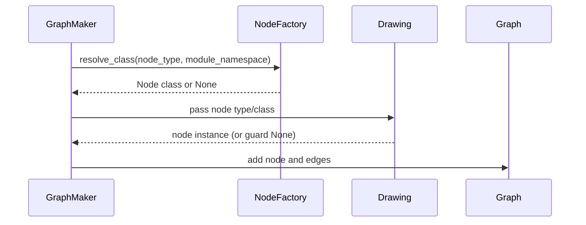

# TerraVision Phase 4 Architecture Updates

## Overview

This document explains how we improved TerraVision's architecture. It covers the resource handler pipeline, the node factory pattern, the graph transformation flow, and the drawing/rendering pipeline. It highlights the transitive linking and grouping patterns introduced and improved in this phase, and where configuration (DISCONNECT_LIST) interacts with code logic.

## Audience

Developers contributing to TerraVision who need to understand the internal architecture and how recent fixes integrate into the system.

## Key Components

- **Resource Handlers**: `modules/resource_handlers/*.py`
- **Node Factory**: `modules/node_factory.py`
- **Graph Maker**: `modules/graphmaker.py`, `modules/graph_utils.py`, `modules/provider_runtime.py`
- **Drawing Pipeline**: `modules/drawing.py`
- **Cloud Config**: `modules/cloud_config/*.py`
- **Tests**: `tests/unit/test_aws_handlers.py`, `tests/integration/test_multicloud.py`

## Architecture Diagram

```mermaid
flowchart TD
  A[Tf Data Parsing (fileparser.py)] --> B[Provider Runtime (provider_runtime.py)]
  B --> C[Resource Handlers (modules/resource_handlers/aws.py)]
  C --> D[Graph Maker (graphmaker.py)]
  D --> E[NodeFactory (node_factory.py)]
  E --> F[Drawing (drawing.py)]
  F --> G[Rendered Diagram (graphviz)]
  B --> H[Cloud Config (cloud_config/aws.py)]
  C --> H
  D --> H
```

## Resource Handler Pipeline

**Purpose**: Normalize Terraform-derived tfdata into resource nodes and edges with provider-specific logic.

**Sequence**:
1. Input tfdata with resources and relationships
2. Handlers (e.g., `aws_handle_subnet_azs()`, `aws_handle_efs()`) transform, group, and link resources
3. Transitive linking functions (e.g., `link_sqs_queue_policy()`, `link_ec2_to_iam_roles()`) create direct edges to improve visualization clarity
4. Output intermediate structures consumed by Graph Maker

**Highlights from Phase 4**:
- **Transitive Linking**:
  - SQS Queue Policy: Lambda → SQS policy → SQS queue now produces Lambda → Queue (correct direction, reversed from prior logic)
  - EC2 → Instance Profile → IAM Role now produces EC2 → Role links
- **Grouping**:
  - EFS mount targets grouped under their parent EFS file system for a coherent hierarchical structure
- **Coverage**:
  - Classic ELB (`aws_elb.*`) detection and handling added

## Node Factory Pattern

NodeFactory resolves resource type strings (e.g., `aws_instance`, `aws_elb`) to concrete node classes.

**New `resolve_class()` method**:
- Supports module namespace lookup for group/cluster classes (e.g., cluster containers, group nodes)
- Detects provider from type prefix (`aws_`, `azurerm_`, `google_`)
- Falls back to `resolve()` for regular nodes
- Handles generic resources gracefully

**Sequence Diagram: Node Resolution**:


## Graph Transformation Flow

**Pre-Graph Transformations (Handlers)**:
- Normalize and enrich tfdata
- Group parent-child (EFS and mount targets)
- Apply transitive linking (EC2/IAM, Lambda/SQS)
- Sanity corrections (subnet AZs, security group orphans)

**Graph Maker**:
- Converts transformed data into graph nodes and edges
- Applies DISCONNECT_LIST rules (as guidance from cloud_config)

**Node Resolution**:
- `NodeFactory.resolve_class()` selects the right node class based on provider and module namespace
- Fallback paths ensure non-crashing behavior

**Drawing/Rendering**:
- Drawing pipeline creates DOT and post-processes with gvpr via `subprocess.run()`
- Handles Optional node returns safely

## Drawing/Rendering Pipeline

**Input**: Graph nodes/edges with resolved classes

**Process**:
- Instantiate nodes, apply styles/images
- Render via graphviz
- Post-process with gvpr (security hardened via `subprocess.run(check=True, capture_output=True)`)

**Output**: PNG/SVG diagrams

**Safety**:
- Optional node handling introduced to prevent unpacking errors
- Dead code removed for clarity and maintainability

## Configuration vs Code

**DISCONNECT_LIST**:
- Narrowed in `cloud_config/aws.py` to only disconnect `aws_iam_role_policy`
- Avoids broad disconnection of all IAM resources

**Code-Level Logic**:
- Handlers and linkers perform fine-grained relationship management
- Prefer handler logic for high fidelity relationships; use DISCONNECT_LIST sparingly for known noisy edges

## Cross-References

- **Transitive Linking**: `modules/resource_handlers/aws.py` lines 934-989
- **Grouping**: `modules/resource_handlers/aws.py` lines 352-388
- **NodeFactory**: `modules/node_factory.py` lines 216-256
- **Drawing safety and subprocess**: `modules/drawing.py` lines 10, 137, 156, 198-209, 369-380, 536-544
- **Cloud Config**: `modules/cloud_config/aws.py` lines 236-242

## How to Extend

- Implement new handlers following the patterns described in `EXTENDING-HANDLERS.md`
- Use transitive linking to simplify intermediate relationship chains for visualization
- Group child resources under parents where the hierarchy is clear (e.g., storage systems)
- Leverage `resolve_class()` with module namespace for group/cluster types
- Write unit tests for each new handler; add or update integration fixtures if diagram output changes
