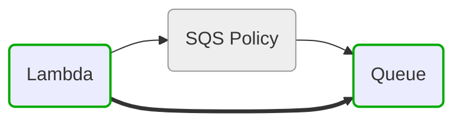
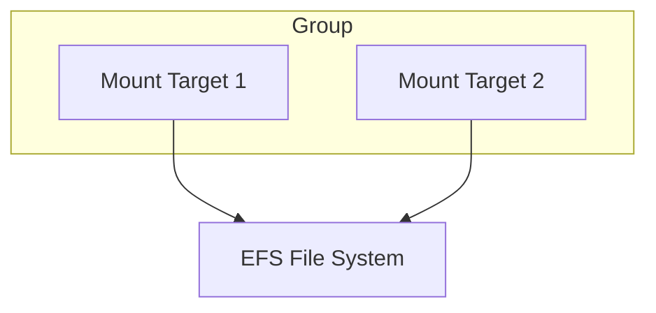

# Extending Resource Handlers: Patterns and Practices

## Purpose

A guide for contributors adding new resource handlers or improving existing ones. It distills Phase 4 patterns: transitive linking, grouping, provider detection, and testing requirements.

## Core Patterns

### 1) Handler Pattern

**Location**: `modules/resource_handlers/<provider>.py`

**Responsibilities**:
- Normalize resource entries from tfdata
- Establish edges with correct directionality and semantics
- Preserve meaningful nodes (avoid accidental pruning)
- Prepare structures for Graph Maker and Drawing

**Recommended steps**:
1. **Input validation**: Ensure required keys exist, initialize defaults (e.g., `hidden`)
2. **Identification**: Detect resource types via prefixes (`aws_`, `azurerm_`, `google_`)
3. **Relationship building**: Add edges and groupings
4. **Error handling**: Be resilient to missing optional fields

---

### 2) Transitive Linking Pattern

**Examples**:
- **FIX07**: `link_sqs_queue_policy()` produces Lambda → Queue
- **FIX08**: `link_ec2_to_iam_roles()` produces EC2 → Role

**Why**:
- Simplifies multi-hop relationships into single, informative edges
- Reduces visual complexity without hiding important nodes

**Implementation tips**:
- Identify intermediate nodes (policies, instance profiles)
- Compute direct "semantic" relationships (producer/consumer, assumes, attaches)
- Add direct edges while keeping original nodes for context

**Code references**:
- `modules/resource_handlers/aws.py` lines 934-989

**Diagram: Transitive Linking**


**Code Example**:
```python
# modules/resource_handlers/aws.py:1010-1024
def link_sqs_queue_policy(terraform_data: Dict[str, List[str]]) -> Dict[str, List[str]]:
    """Create transitive links from resources to queues via policies."""
    result = dict(terraform_data)
    
    # Map policies to queues
    policy_to_queue = {}
    for resource, deps in terraform_data.items():
        if "aws_sqs_queue_policy" in resource:
            for dep in deps:
                if "aws_sqs_queue" in dep:
                    policy_to_queue[resource] = dep
    
    # Add transitive links
    for resource, deps in result.items():
        for dep in deps:
            if dep in policy_to_queue:
                queue = policy_to_queue[dep]
                if queue not in result[resource]:
                    result[resource].append(queue)
    
    return result
```

---

### 3) Grouping Pattern

**Example**:
- **FIX06**: `aws_handle_efs()` groups mount targets under EFS

**Why**:
- Hierarchical resources benefit from nested representation
- Improves clarity for storage, container orchestration, clusters, etc.

**Implementation tips**:
- Determine parent identifiers (e.g., file system ID)
- Collect child resources and attach via nested structure
- Maintain links outward from the parent node

**Code references**:
- `modules/resource_handlers/aws.py` lines 352-388

**Diagram: Grouping**


**Code Example**:
```python
# modules/resource_handlers/aws.py:352-388
def aws_handle_efs(tfdata: Dict[str, Any]) -> Dict[str, Any]:
    """Group EFS mount targets under their parent file system."""
    
    efs_filesystems = helpers.list_of_dictkeys_containing(
        tfdata["graphdict"], "aws_efs_file_system"
    )
    efs_mount_targets = helpers.list_of_dictkeys_containing(
        tfdata["graphdict"], "aws_efs_mount_target"
    )
    
    for fs in efs_filesystems:
        fs_id = tfdata["meta_data"].get(fs, {}).get("id", "")
        
        for mt in efs_mount_targets:
            mt_fs_id = tfdata["meta_data"].get(mt, {}).get("file_system_id", "")
            
            if mt_fs_id == fs_id:
                # Add mount target as child of file system
                if mt not in tfdata["graphdict"][fs]:
                    tfdata["graphdict"][fs].append(mt)
                
                # Remove mount target as standalone node
                if mt in tfdata["graphdict"]:
                    del tfdata["graphdict"][mt]
    
    return tfdata
```

---

### 4) Provider Detection via NodeFactory.resolve_class()

**Purpose**:
- Find group/cluster classes under module namespace
- Detect provider prefix (`aws_`, `azurerm_`, `google_`) to select correct class
- Fall back to standard `resolve()` when needed

**Usage**:
```python
# In drawing.py
nodeClass = node_factory.resolve_class(
    node_type, 
    module_namespace=sys.modules[__name__].__dict__
)
```

**Code references**:
- `modules/node_factory.py` lines 216-256
- `modules/drawing.py` lines 334, 517

**Implementation**:
```python
# modules/node_factory.py:216-256
def resolve_class(
    self, 
    resource_type: str, 
    module_namespace: Optional[Dict[str, Any]] = None
) -> Optional[Type]:
    """Resolve resource type to node class with provider detection.
    
    Args:
        resource_type: Resource type (e.g., 'aws_vpc', 'azurerm_vnet')
        module_namespace: Optional namespace for group/cluster lookup
    
    Returns:
        Node class or None if not found
    """
    # Try module namespace first for groups/clusters
    if module_namespace:
        # Look for capitalized class names
        class_name = self._to_class_name(resource_type)
        if class_name in module_namespace:
            return module_namespace[class_name]
    
    # Detect provider from prefix
    if resource_type.startswith("aws_"):
        provider = "aws"
    elif resource_type.startswith("azurerm_"):
        provider = "azure"
    elif resource_type.startswith("google_"):
        provider = "gcp"
    else:
        provider = "aws"  # default
    
    # Fall back to standard resolve
    return self.resolve(resource_type, provider)
```

---

### 5) DISCONNECT_LIST vs Handler Logic

**Guidance**:
- **Prefer** precise handler logic over broad disconnection
- Use DISCONNECT_LIST **sparingly** to suppress specific noisy edges
- **Example**: Only disconnect `aws_iam_role_policy`

**Code references**:
- `modules/cloud_config/aws.py` lines 236-242

**Anti-pattern**:
```python
# BAD: Over-broad disconnection
DISCONNECT_LIST = [
    "aws_iam_role_policy",
    "aws_iam_role",      # Too broad!
    "aws_iam_policy",    # Breaks IAM visualization
]
```

**Correct pattern**:
```python
# GOOD: Narrow, targeted disconnection
DISCONNECT_LIST = [
    "aws_iam_role_policy",  # Only inline policies
]

# Handle relationships in code instead
def link_ec2_to_iam_roles(...):
    # Create meaningful transitive links
    # while preserving visibility
```

---

## Development Workflow

### 1. Implement new handler

```python
def aws_handle_new_resource(tfdata: Dict[str, Any]) -> Dict[str, Any]:
    """Handle new resource type.
    
    Args:
        tfdata: Terraform data dictionary
    
    Returns:
        Updated tfdata with new resource handling
    """
    # 1. Detect resource types
    resources = helpers.list_of_dictkeys_containing(
        tfdata["graphdict"], "aws_new_resource"
    )
    
    # 2. Build edges with correct direction
    for resource in resources:
        # Add parent relationships
        parent_id = tfdata["meta_data"].get(resource, {}).get("parent_id")
        if parent_id:
            tfdata["graphdict"][resource].append(parent_id)
    
    # 3. Apply grouping when hierarchical
    # 4. Add transitive links when multi-hop relationships exist
    
    return tfdata
```

### 2. Update NodeFactory (if adding group/cluster classes)

```python
# resource_classes/aws/groups.py
class NewResourceGroup(Cluster):
    """New resource group class."""
    _provider = "aws"
    _type = "new_resource_group"
```

### 3. Write unit tests

```python
# tests/unit/test_aws_handlers.py
class TestAwsHandleNewResource(unittest.TestCase):
    def test_groups_children_under_parent(self):
        tfdata = {
            "graphdict": {
                "aws_parent.main": [],
                "aws_child.one": ["aws_parent.main"],
            },
            "meta_data": {...}
        }
        
        result = aws_handle_new_resource(tfdata)
        
        # Assert grouping occurred
        self.assertIn("aws_child.one", result["graphdict"]["aws_parent.main"])
```

### 4. Update integration fixtures if diagram output changes

```bash
# Regenerate expected output
poetry run python terravision.py graphdata \
  --source tests/json/test-tfdata.json \
  --outfile tests/json/test-expected.json
```

---

## Code Snippets

### Transitive Link (EC2 → Role)

**Path**: `modules/resource_handlers/aws.py:976-1006`

```python
# Map instance profiles to roles
profile_to_role = {}
for resource, deps in terraform_data.items():
    if "aws_iam_instance_profile" in resource:
        for dep in deps:
            if "aws_iam_role" in dep and "policy" not in dep:
                profile_to_role[resource] = dep

# Add transitive EC2 → Role links
for resource, deps in result.items():
    if "aws_instance" in resource:
        for dep in deps:
            if dep in profile_to_role:
                role = profile_to_role[dep]
                if role not in result[resource]:
                    result[resource].append(role)
```

### Grouping (EFS)

**Path**: `modules/resource_handlers/aws.py:352-388`

```python
# Find parent and children
efs_filesystems = helpers.list_of_dictkeys_containing(
    tfdata["graphdict"], "aws_efs_file_system"
)
mount_targets = helpers.list_of_dictkeys_containing(
    tfdata["graphdict"], "aws_efs_mount_target"
)

# Group children under parent
for fs in efs_filesystems:
    for mt in mount_targets:
        if matches_parent(mt, fs):
            tfdata["graphdict"][fs].append(mt)
            del tfdata["graphdict"][mt]
```

### Provider Detection in Drawing

**Path**: `modules/drawing.py:334, 517`

```python
# Resolve class with module namespace for groups
nodeClass = node_factory.resolve_class(
    node_type, 
    module_namespace=sys.modules[__name__].__dict__
)
```

---

## Testing Requirements

### Unit Tests
Replicate patterns in `tests/unit/test_aws_handlers.py`:
- Test positive cases (resources exist and are handled)
- Test negative cases (no resources, missing data)
- Test edge cases (empty graphs, malformed metadata)
- Validate edge directionality and grouping

### Integration Tests
Update `tests/json/*expected*.json` when structural changes affect diagrams:
```bash
poetry run pytest tests/integration_test.py::test_graphdata_output
```

### Performance
Ensure new logic does not degrade performance:
- Avoid O(n²) scans; index by resource ID when possible
- Cache repeated operations
- See `TESTING-STRATEGY.md` for performance testing guidance

---

## Quick Reference

| Pattern | Use When | Example |
|---------|----------|---------|
| **Transitive Linking** | Multi-hop indirect relationships | Lambda→Policy→Queue becomes Lambda→Queue |
| **Grouping** | Parent-child hierarchy exists | EFS file system contains mount targets |
| **Provider Detection** | Need correct class for resource type | `aws_vpc` → AWS VPC class |
| **DISCONNECT_LIST** | Noisy edges that always clutter | Inline IAM role policies |
| **Handler Logic** | Complex relationship management | All other cases |

---

## See Also

- `ARCHITECTURE.md` - Overall system architecture
- `BUG-FIXES-GUIDE.md` - Detailed bug fix examples
- `TESTING-STRATEGY.md` - Testing patterns and requirements
- `CODE-REVIEW-CHECKLIST.md` - Quality standards
