# Cloud architecture diagram examples

Example architecture diagrams for AWS, Azure and Google Cloud, drawn by TerraVision with each provider's official icons. Every example comes with a prompt you can give to Claude or ChatGPT to draw something similar, and the source file that reproduces it exactly. Use them as starting points: ask your assistant to change one, or download it and edit it in draw.io.

They are drawn the way enterprises deploy: workloads sit in VPCs, subnets and availability zones, and reach managed services through private endpoints (VPC endpoints, Azure private endpoints, Private Service Connect) rather than the internet. Each provider's official grouping conventions are built in, not generic boxes. Every network and subnet is labelled with its CIDR range.

!!! note "Your results will vary"
    A diagram drawn from a prompt depends on the AI model behind your assistant. Larger, more capable models follow the prompt more closely and add more of the detail shown here; smaller models may leave services out or group them differently. Ask for what is missing in a follow-up message, or use the source file under each example to reproduce it exactly.

| Example | Cloud |
|---|---|
| [AWS three-tier web application architecture diagram](#aws-three-tier-web-application-architecture-diagram) | AWS |
| [Amazon EKS with Karpenter architecture diagram](#amazon-eks-karpenter-architecture-diagram) | AWS |
| [AWS serverless event-driven architecture diagram](#aws-serverless-event-driven-architecture-diagram) | AWS |
| [AWS data lake architecture diagram](#aws-data-lake-architecture-diagram) | AWS |
| [AWS multi-region failover architecture diagram](#aws-multi-region-failover-architecture-diagram) | AWS |
| [AWS multi-account network architecture diagram](#aws-multi-account-network-architecture-diagram) | AWS |
| [Azure three-tier web application architecture diagram](#azure-three-tier-web-application-architecture-diagram) | Azure |
| [Azure hub-and-spoke network architecture diagram](#azure-hub-and-spoke-architecture-diagram) | Azure |
| [Azure AKS microservices architecture diagram](#azure-aks-architecture-diagram) | Azure |
| [Google Cloud three-tier web application architecture diagram](#google-cloud-three-tier-web-application-architecture-diagram) | Google Cloud |
| [Google Cloud GKE microservices architecture diagram](#google-cloud-gke-architecture-diagram) | Google Cloud |
| [Google Cloud data pipeline architecture diagram](#google-cloud-data-pipeline-architecture-diagram) | Google Cloud |

!!! tip "The quickest way to make one of these your own"
    Install TerraVision in [Claude Desktop or the ChatGPT desktop app](ai-assistants.md), paste the prompt under any example, then keep talking: *"add a WAF"*, *"make it multi-region"*, *"show how a request flows through it"*, *"write the Terraform for this"*.

## AWS three-tier web application architecture diagram { #aws-three-tier-web-application-architecture-diagram }

A classic three-tier web application on AWS. CloudFront serves a static site from S3 and routes requests to Application Load Balancers in two availability zones. Each zone has a public subnet (load balancer and NAT gateway), a private subnet (EC2 application servers) and a data subnet (Aurora PostgreSQL and ElastiCache). The app servers reach S3 through a gateway VPC endpoint and Secrets Manager through an interface endpoint in each private subnet, so that traffic never crosses the internet.

[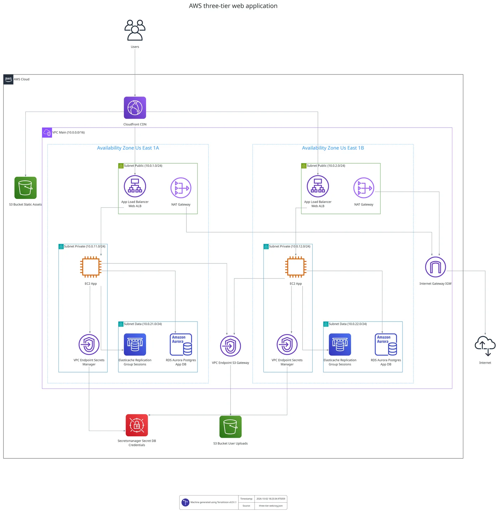{ width=1400 height=1439 .no-lightbox }](https://raw.githubusercontent.com/patrickchugh/terravision/main/examples/graphs/three-tier-web.png)

**Ask your AI assistant:**

> Draw an AWS three-tier web app: CloudFront in front of an S3 static site and an Application Load Balancer, EC2 app servers in private subnets across two availability zones, Aurora PostgreSQL and ElastiCache in data subnets, NAT gateways in the public subnets, an S3 gateway endpoint for an uploads bucket and a Secrets Manager interface endpoint in each private subnet.

**Or reproduce it exactly** from the source file [three-tier-web.tvg.json](https://github.com/patrickchugh/terravision/blob/main/examples/graphs/three-tier-web.tvg.json) and its CIDR ranges in [three-tier-web.annotations.yml](https://github.com/patrickchugh/terravision/blob/main/examples/graphs/three-tier-web.annotations.yml):

```bash
terravision draw --source three-tier-web.tvg.json --annotate three-tier-web.annotations.yml --format svg      # or png, pdf
terravision draw --source three-tier-web.tvg.json --annotate three-tier-web.annotations.yml --format drawio   # editable in draw.io or Lucidchart
```

Download: [PNG](https://raw.githubusercontent.com/patrickchugh/terravision/main/examples/graphs/three-tier-web.png) · [SVG](https://raw.githubusercontent.com/patrickchugh/terravision/main/examples/graphs/three-tier-web.svg) · [source graph](https://raw.githubusercontent.com/patrickchugh/terravision/main/examples/graphs/three-tier-web.tvg.json) · [CIDR annotations](https://raw.githubusercontent.com/patrickchugh/terravision/main/examples/graphs/three-tier-web.annotations.yml)

## Amazon EKS with Karpenter architecture diagram { #amazon-eks-karpenter-architecture-diagram }

A Kubernetes platform on Amazon EKS that scales its nodes with Karpenter. The VPC spans three availability zones. In each zone, a public subnet holds an Application Load Balancer and a NAT gateway, and a private subnet holds the Karpenter controller, a Karpenter NodePool of On-Demand and Spot nodes, and interface VPC endpoints for ECR, EC2 and SQS. A data subnet holds an Aurora PostgreSQL instance. Nodes pull image layers through an S3 gateway endpoint. The EKS control plane sits in its own AWS-managed account, and an EventBridge rule sends Spot interruption warnings to the SQS queue Karpenter reads.

[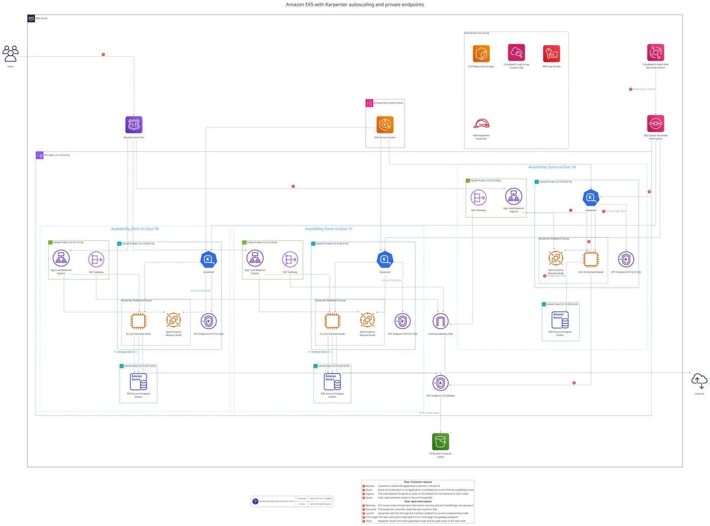{ width=1400 height=985 loading=lazy .no-lightbox }](https://raw.githubusercontent.com/patrickchugh/terravision/main/examples/graphs/aws-eks-karpenter.png)

**Ask your AI assistant:**

> Draw an EKS cluster that uses Karpenter for node autoscaling, across three availability zones: an ALB and NAT gateway in each public subnet; the Karpenter controller, a NodePool of On-Demand and Spot nodes and interface VPC endpoints for ECR, EC2 and SQS in each private subnet; Aurora PostgreSQL in data subnets; an S3 gateway endpoint; Route 53 in front; and the EventBridge rule and SQS queue Karpenter uses for Spot interruptions.

**Or reproduce it exactly** from the source file [aws-eks-karpenter.tvg.json](https://github.com/patrickchugh/terravision/blob/main/examples/graphs/aws-eks-karpenter.tvg.json) and its CIDR ranges in [aws-eks-karpenter.annotations.yml](https://github.com/patrickchugh/terravision/blob/main/examples/graphs/aws-eks-karpenter.annotations.yml):

```bash
terravision draw --source aws-eks-karpenter.tvg.json --annotate aws-eks-karpenter.annotations.yml --format svg      # or png, pdf
terravision draw --source aws-eks-karpenter.tvg.json --annotate aws-eks-karpenter.annotations.yml --format drawio   # editable in draw.io or Lucidchart
```

Download: [PNG](https://raw.githubusercontent.com/patrickchugh/terravision/main/examples/graphs/aws-eks-karpenter.png) · [SVG](https://raw.githubusercontent.com/patrickchugh/terravision/main/examples/graphs/aws-eks-karpenter.svg) · [source graph](https://raw.githubusercontent.com/patrickchugh/terravision/main/examples/graphs/aws-eks-karpenter.tvg.json) · [CIDR annotations](https://raw.githubusercontent.com/patrickchugh/terravision/main/examples/graphs/aws-eks-karpenter.annotations.yml)

## AWS serverless event-driven architecture diagram { #aws-serverless-event-driven-architecture-diagram }

A serverless order platform whose Lambda functions run inside a VPC, as most enterprises require. Customers call an HTTP API on API Gateway, authenticated with Cognito, which invokes order Lambdas in private subnets across two availability zones. The functions reach DynamoDB through a gateway VPC endpoint, and EventBridge, SNS and Secrets Manager through interface endpoints in a dedicated endpoints subnet in each zone. Only the payment step leaves the VPC, through NAT gateways, to reach an external payment provider. The EventBridge bus fans out to a Step Functions fulfilment workflow, an SQS notifications queue with a dead-letter queue, and Firehose to an S3 event lake catalogued by Glue and queried with Athena.

[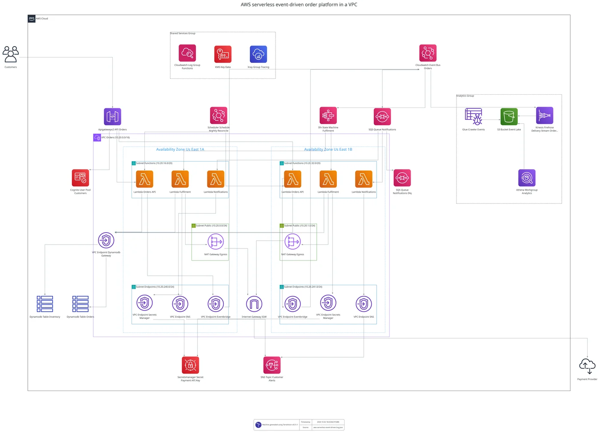{ width=1400 height=1011 loading=lazy .no-lightbox }](https://raw.githubusercontent.com/patrickchugh/terravision/main/examples/graphs/aws-serverless-event-driven.png)

**Ask your AI assistant:**

> Draw an AWS serverless event-driven order system with every Lambda in a VPC across two availability zones: API Gateway with Cognito invoking order Lambdas in private subnets, a DynamoDB gateway endpoint, interface endpoints for EventBridge, SNS and Secrets Manager in an endpoints subnet per zone, and NAT gateways only for the payment provider. The EventBridge bus fans out to a Step Functions fulfilment workflow, an SQS notifications queue with a DLQ, and Firehose to an S3 data lake with Glue and Athena.

**Or reproduce it exactly** from the source file [aws-serverless-event-driven.tvg.json](https://github.com/patrickchugh/terravision/blob/main/examples/graphs/aws-serverless-event-driven.tvg.json) and its CIDR ranges in [aws-serverless-event-driven.annotations.yml](https://github.com/patrickchugh/terravision/blob/main/examples/graphs/aws-serverless-event-driven.annotations.yml):

```bash
terravision draw --source aws-serverless-event-driven.tvg.json --annotate aws-serverless-event-driven.annotations.yml --format svg      # or png, pdf
terravision draw --source aws-serverless-event-driven.tvg.json --annotate aws-serverless-event-driven.annotations.yml --format drawio   # editable in draw.io or Lucidchart
```

Download: [PNG](https://raw.githubusercontent.com/patrickchugh/terravision/main/examples/graphs/aws-serverless-event-driven.png) · [SVG](https://raw.githubusercontent.com/patrickchugh/terravision/main/examples/graphs/aws-serverless-event-driven.svg) · [source graph](https://raw.githubusercontent.com/patrickchugh/terravision/main/examples/graphs/aws-serverless-event-driven.tvg.json) · [CIDR annotations](https://raw.githubusercontent.com/patrickchugh/terravision/main/examples/graphs/aws-serverless-event-driven.annotations.yml)

## AWS data lake architecture diagram { #aws-data-lake-architecture-diagram }

A data lake and analytics platform on AWS whose processing runs inside a VPC. Across two availability zones, private subnets hold DMS replication from an Aurora MySQL source, Glue jobs, EMR Serverless Spark, Amazon MWAA (Airflow) orchestration and Redshift Serverless. All of them read and write S3 through a gateway VPC endpoint, and reach the Glue Data Catalog and Secrets Manager through interface endpoints in each zone. Outside the VPC, Kinesis, Firehose and Transfer Family ingest clickstream and partner files into the raw S3 zone, Lake Formation governs access, and analysts use QuickSight over Athena.

[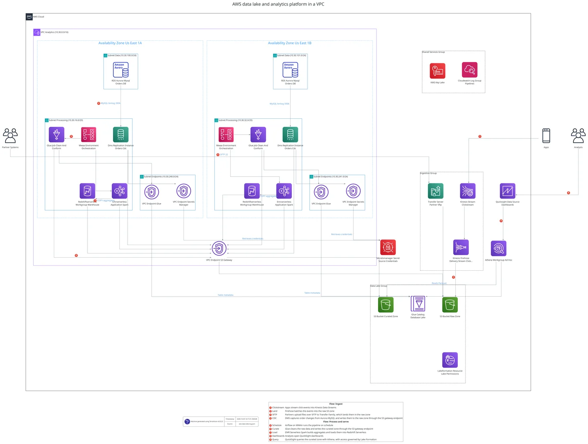{ width=1400 height=1002 loading=lazy .no-lightbox }](https://raw.githubusercontent.com/patrickchugh/terravision/main/examples/graphs/aws-data-lake.png)

**Ask your AI assistant:**

> Draw an AWS data lake with processing in a VPC across two availability zones: DMS from Aurora MySQL, Glue jobs, EMR Serverless, MWAA and Redshift Serverless in private subnets, an S3 gateway endpoint, and Glue and Secrets Manager interface endpoints in each zone. Kinesis, Firehose and Transfer Family land data in a raw S3 zone, Glue writes a curated zone, Lake Formation governs it, and QuickSight and Athena serve analysts.

**Or reproduce it exactly** from the source file [aws-data-lake.tvg.json](https://github.com/patrickchugh/terravision/blob/main/examples/graphs/aws-data-lake.tvg.json) and its CIDR ranges in [aws-data-lake.annotations.yml](https://github.com/patrickchugh/terravision/blob/main/examples/graphs/aws-data-lake.annotations.yml):

```bash
terravision draw --source aws-data-lake.tvg.json --annotate aws-data-lake.annotations.yml --format svg      # or png, pdf
terravision draw --source aws-data-lake.tvg.json --annotate aws-data-lake.annotations.yml --format drawio   # editable in draw.io or Lucidchart
```

Download: [PNG](https://raw.githubusercontent.com/patrickchugh/terravision/main/examples/graphs/aws-data-lake.png) · [SVG](https://raw.githubusercontent.com/patrickchugh/terravision/main/examples/graphs/aws-data-lake.svg) · [source graph](https://raw.githubusercontent.com/patrickchugh/terravision/main/examples/graphs/aws-data-lake.tvg.json) · [CIDR annotations](https://raw.githubusercontent.com/patrickchugh/terravision/main/examples/graphs/aws-data-lake.annotations.yml)

## AWS multi-region failover architecture diagram { #aws-multi-region-failover-architecture-diagram }

An active-passive multi-region design on AWS. Route 53 failover routing sends users to the primary region (us-east-1) and switches to the standby region (eu-west-1) when health checks fail. Each region has a VPC across two availability zones, with Application Load Balancers in public subnets, ECS on Fargate services in application subnets and Aurora PostgreSQL in data subnets. The services reach DynamoDB through a gateway VPC endpoint in their own region. Aurora Global Database replicates from the primary to the standby, DynamoDB global tables replicate session data, and S3 cross-region replication copies assets.

[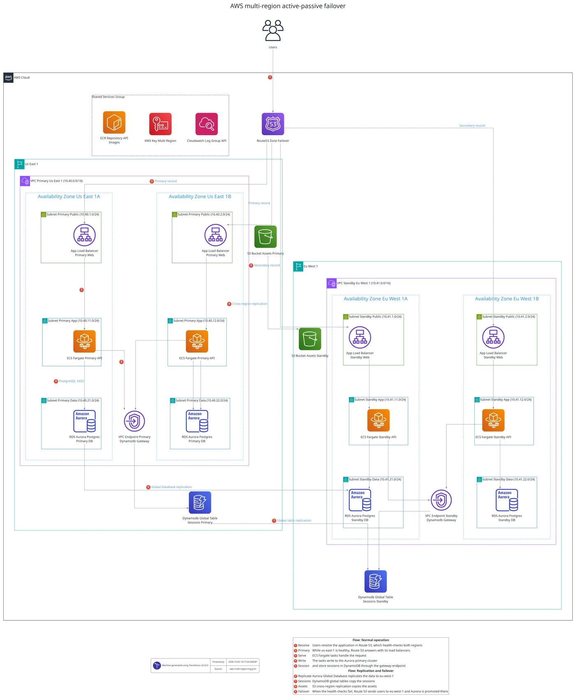{ width=1400 height=1607 loading=lazy .no-lightbox }](https://raw.githubusercontent.com/patrickchugh/terravision/main/examples/graphs/aws-multi-region.png)

**Ask your AI assistant:**

> Draw an AWS active-passive multi-region architecture: Route 53 failover between a primary region and a standby region, each with a VPC across two availability zones, ALBs in public subnets, ECS Fargate services in app subnets, Aurora PostgreSQL in data subnets and a DynamoDB gateway endpoint. Show Aurora Global Database replication, DynamoDB global tables and S3 cross-region replication between the regions.

**Or reproduce it exactly** from the source file [aws-multi-region.tvg.json](https://github.com/patrickchugh/terravision/blob/main/examples/graphs/aws-multi-region.tvg.json) and its CIDR ranges in [aws-multi-region.annotations.yml](https://github.com/patrickchugh/terravision/blob/main/examples/graphs/aws-multi-region.annotations.yml):

```bash
terravision draw --source aws-multi-region.tvg.json --annotate aws-multi-region.annotations.yml --format svg      # or png, pdf
terravision draw --source aws-multi-region.tvg.json --annotate aws-multi-region.annotations.yml --format drawio   # editable in draw.io or Lucidchart
```

Download: [PNG](https://raw.githubusercontent.com/patrickchugh/terravision/main/examples/graphs/aws-multi-region.png) · [SVG](https://raw.githubusercontent.com/patrickchugh/terravision/main/examples/graphs/aws-multi-region.svg) · [source graph](https://raw.githubusercontent.com/patrickchugh/terravision/main/examples/graphs/aws-multi-region.tvg.json) · [CIDR annotations](https://raw.githubusercontent.com/patrickchugh/terravision/main/examples/graphs/aws-multi-region.annotations.yml)

## AWS multi-account network architecture diagram { #aws-multi-account-network-architecture-diagram }

A hub-and-spoke network for an AWS organisation. A Transit Gateway in the network account connects a site-to-site VPN from the corporate data centre to production, development and shared services VPCs, each in its own account. All traffic between VPCs, and out to the internet, passes through AWS Network Firewall in a central inspection VPC across two availability zones. A central egress VPC holds the NAT gateways and the internet gateway. The shared services VPC holds interface VPC endpoints and the corporate Active Directory.

[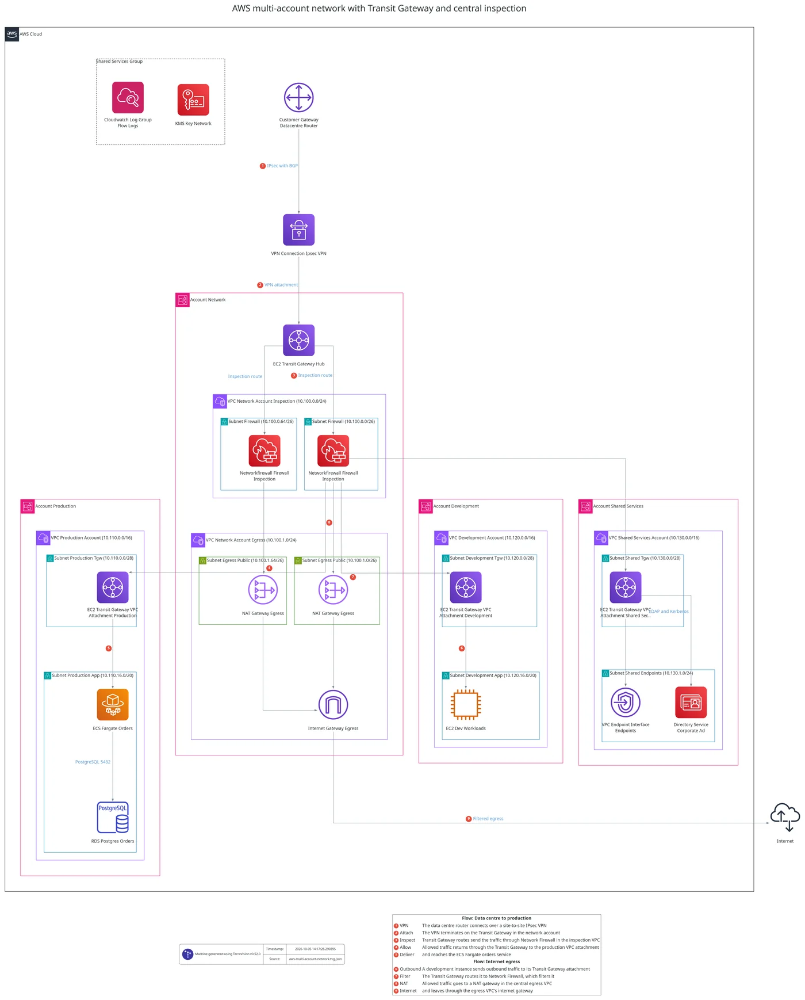{ width=1400 height=1655 loading=lazy .no-lightbox }](https://raw.githubusercontent.com/patrickchugh/terravision/main/examples/graphs/aws-multi-account-network.png)

**Ask your AI assistant:**

> Draw an AWS multi-account network: a Transit Gateway hub in a network account with a site-to-site VPN to the data centre, an inspection VPC with Network Firewall in two availability zones, a central egress VPC with NAT gateways, and spoke VPCs for production (ECS Fargate and RDS), development (EC2) and shared services (VPC endpoints and Directory Service), each attached through its own Transit Gateway subnet.

**Or reproduce it exactly** from the source file [aws-multi-account-network.tvg.json](https://github.com/patrickchugh/terravision/blob/main/examples/graphs/aws-multi-account-network.tvg.json) and its CIDR ranges in [aws-multi-account-network.annotations.yml](https://github.com/patrickchugh/terravision/blob/main/examples/graphs/aws-multi-account-network.annotations.yml):

```bash
terravision draw --source aws-multi-account-network.tvg.json --annotate aws-multi-account-network.annotations.yml --format svg      # or png, pdf
terravision draw --source aws-multi-account-network.tvg.json --annotate aws-multi-account-network.annotations.yml --format drawio   # editable in draw.io or Lucidchart
```

Download: [PNG](https://raw.githubusercontent.com/patrickchugh/terravision/main/examples/graphs/aws-multi-account-network.png) · [SVG](https://raw.githubusercontent.com/patrickchugh/terravision/main/examples/graphs/aws-multi-account-network.svg) · [source graph](https://raw.githubusercontent.com/patrickchugh/terravision/main/examples/graphs/aws-multi-account-network.tvg.json) · [CIDR annotations](https://raw.githubusercontent.com/patrickchugh/terravision/main/examples/graphs/aws-multi-account-network.annotations.yml)

## Azure three-tier web application architecture diagram { #azure-three-tier-web-application-architecture-diagram }

A three-tier web application on Azure. DNS and Front Door with WAF sit in front of a Static Web App and an Application Gateway in its own subnet. Container Apps run across two zones inside a virtual network, Azure SQL sits behind a private endpoint in the data subnet, and a NAT gateway provides outbound access. Key Vault, Log Analytics and the container registry are drawn as shared services.

[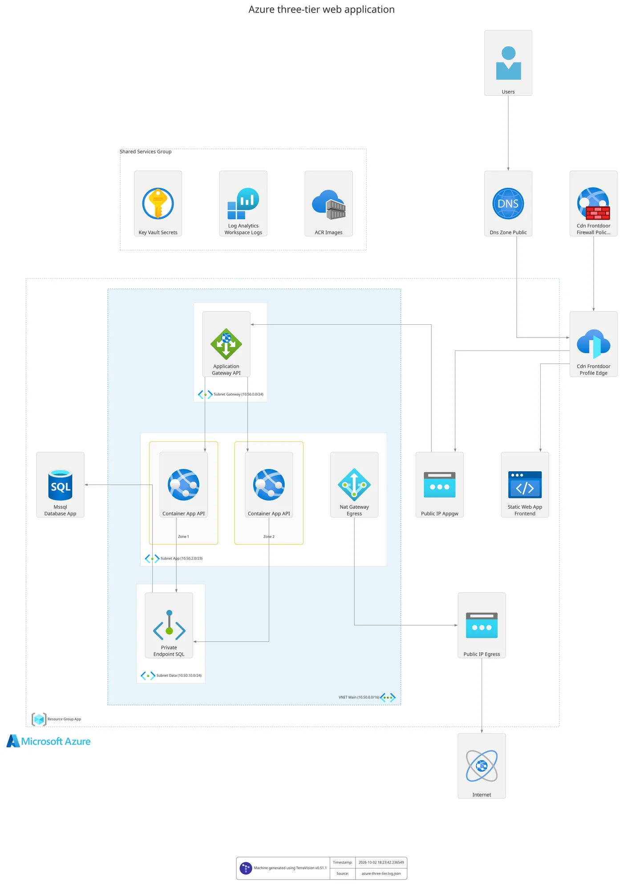{ width=1400 height=1987 loading=lazy .no-lightbox }](https://raw.githubusercontent.com/patrickchugh/terravision/main/examples/graphs/azure-three-tier.png)

**Ask your AI assistant:**

> Draw an Azure three-tier web app: Front Door with WAF, a Static Web App, Application Gateway in its own subnet, Container Apps across two zones, Azure SQL behind a private endpoint, a NAT gateway, and Key Vault, Log Analytics and a container registry as shared services.

**Or reproduce it exactly** from the source file [azure-three-tier.tvg.json](https://github.com/patrickchugh/terravision/blob/main/examples/graphs/azure-three-tier.tvg.json) and its CIDR ranges in [azure-three-tier.annotations.yml](https://github.com/patrickchugh/terravision/blob/main/examples/graphs/azure-three-tier.annotations.yml):

```bash
terravision draw --source azure-three-tier.tvg.json --annotate azure-three-tier.annotations.yml --format svg      # or png, pdf
terravision draw --source azure-three-tier.tvg.json --annotate azure-three-tier.annotations.yml --format drawio   # editable in draw.io or Lucidchart
```

Download: [PNG](https://raw.githubusercontent.com/patrickchugh/terravision/main/examples/graphs/azure-three-tier.png) · [SVG](https://raw.githubusercontent.com/patrickchugh/terravision/main/examples/graphs/azure-three-tier.svg) · [source graph](https://raw.githubusercontent.com/patrickchugh/terravision/main/examples/graphs/azure-three-tier.tvg.json) · [CIDR annotations](https://raw.githubusercontent.com/patrickchugh/terravision/main/examples/graphs/azure-three-tier.annotations.yml)

## Azure hub-and-spoke network architecture diagram { #azure-hub-and-spoke-architecture-diagram }

An Azure hub-and-spoke landing zone. The hub virtual network, in a connectivity resource group, holds a VPN gateway to the head office, Azure Firewall with a central firewall policy, Azure Bastion for administration and a Private DNS Resolver. Two spoke virtual networks are peered to the hub. The web workload spoke has an Application Gateway in front of a virtual machine scale set across two zones, with Azure SQL behind a private endpoint. The internal apps spoke has a Windows virtual machine and PostgreSQL Flexible Server behind a private endpoint. Outbound traffic leaves through the firewall's public IP.

[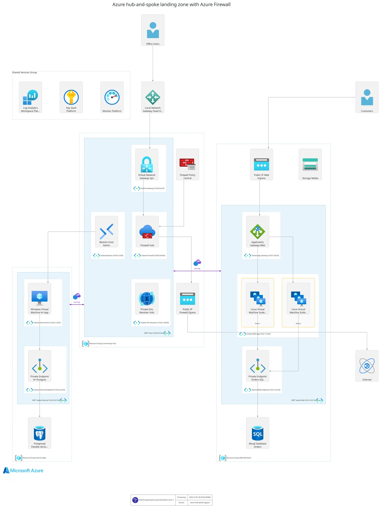{ width=1400 height=1865 loading=lazy .no-lightbox }](https://raw.githubusercontent.com/patrickchugh/terravision/main/examples/graphs/azure-hub-spoke.png)

**Ask your AI assistant:**

> Draw an Azure hub-and-spoke landing zone: a hub VNet with a VPN gateway to the head office, Azure Firewall with a firewall policy, Bastion and a Private DNS Resolver, peered to two spokes. One spoke runs a public web app (Application Gateway, a VM scale set across two zones, Azure SQL via private endpoint). The other runs an internal Windows VM with PostgreSQL Flexible Server via private endpoint. Send outbound traffic through the firewall.

**Or reproduce it exactly** from the source file [azure-hub-spoke.tvg.json](https://github.com/patrickchugh/terravision/blob/main/examples/graphs/azure-hub-spoke.tvg.json) and its CIDR ranges in [azure-hub-spoke.annotations.yml](https://github.com/patrickchugh/terravision/blob/main/examples/graphs/azure-hub-spoke.annotations.yml):

```bash
terravision draw --source azure-hub-spoke.tvg.json --annotate azure-hub-spoke.annotations.yml --format svg      # or png, pdf
terravision draw --source azure-hub-spoke.tvg.json --annotate azure-hub-spoke.annotations.yml --format drawio   # editable in draw.io or Lucidchart
```

Download: [PNG](https://raw.githubusercontent.com/patrickchugh/terravision/main/examples/graphs/azure-hub-spoke.png) · [SVG](https://raw.githubusercontent.com/patrickchugh/terravision/main/examples/graphs/azure-hub-spoke.svg) · [source graph](https://raw.githubusercontent.com/patrickchugh/terravision/main/examples/graphs/azure-hub-spoke.tvg.json) · [CIDR annotations](https://raw.githubusercontent.com/patrickchugh/terravision/main/examples/graphs/azure-hub-spoke.annotations.yml)

## Azure AKS microservices architecture diagram { #azure-aks-architecture-diagram }

Microservices on Azure Kubernetes Service. Front Door with a WAF policy routes customers to an Application Gateway in its own subnet, which sends traffic to AKS node pools across three availability zones. The services reach Cosmos DB, Service Bus and Azure Cache for Redis only through private endpoints in a dedicated subnet. A NAT gateway handles outbound traffic. Container Registry, Key Vault, Log Analytics and Azure Monitor are shared services.

[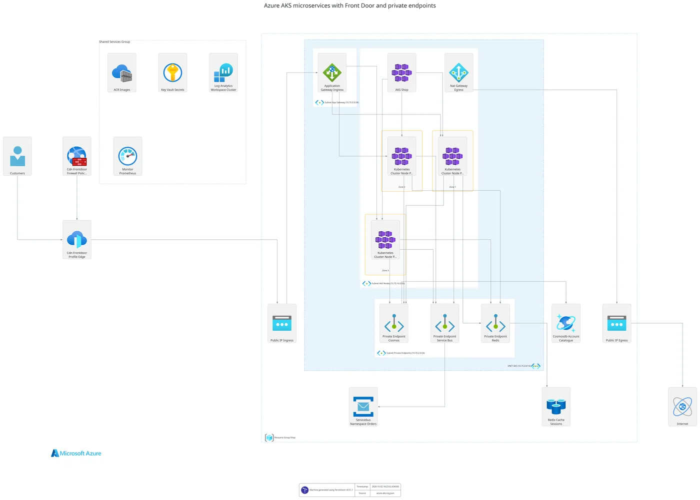{ width=1400 height=1001 loading=lazy .no-lightbox }](https://raw.githubusercontent.com/patrickchugh/terravision/main/examples/graphs/azure-aks.png)

**Ask your AI assistant:**

> Draw an AKS microservices platform on Azure: Front Door with WAF in front of an Application Gateway, an AKS cluster with node pools across three zones, Cosmos DB, Service Bus and Redis reached through private endpoints in their own subnet, a NAT gateway for egress, and ACR, Key Vault, Log Analytics and Azure Monitor as shared services.

**Or reproduce it exactly** from the source file [azure-aks.tvg.json](https://github.com/patrickchugh/terravision/blob/main/examples/graphs/azure-aks.tvg.json) and its CIDR ranges in [azure-aks.annotations.yml](https://github.com/patrickchugh/terravision/blob/main/examples/graphs/azure-aks.annotations.yml):

```bash
terravision draw --source azure-aks.tvg.json --annotate azure-aks.annotations.yml --format svg      # or png, pdf
terravision draw --source azure-aks.tvg.json --annotate azure-aks.annotations.yml --format drawio   # editable in draw.io or Lucidchart
```

Download: [PNG](https://raw.githubusercontent.com/patrickchugh/terravision/main/examples/graphs/azure-aks.png) · [SVG](https://raw.githubusercontent.com/patrickchugh/terravision/main/examples/graphs/azure-aks.svg) · [source graph](https://raw.githubusercontent.com/patrickchugh/terravision/main/examples/graphs/azure-aks.tvg.json) · [CIDR annotations](https://raw.githubusercontent.com/patrickchugh/terravision/main/examples/graphs/azure-aks.annotations.yml)

## Google Cloud three-tier web application architecture diagram { #google-cloud-three-tier-web-application-architecture-diagram }

A three-tier web application on Google Cloud. A global HTTPS load balancer with Cloud Armor serves a React site from Cloud Storage and routes API traffic to a managed instance group across two zones in us-central1, with Cloud Router and Cloud NAT. Cloud SQL and Memorystore sit on the VPC network, alongside Secret Manager, logging and Artifact Registry.

[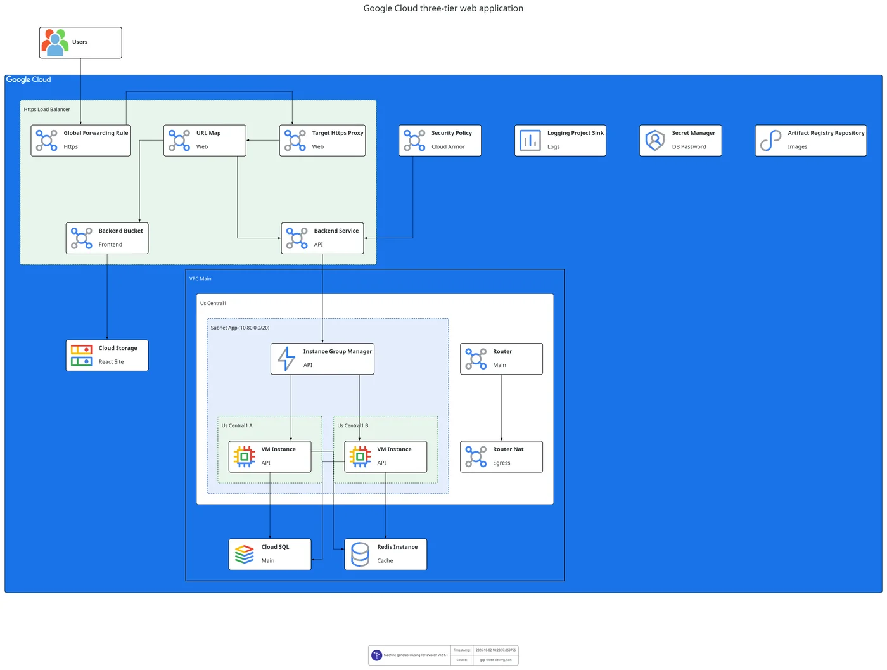{ width=1400 height=1057 loading=lazy .no-lightbox }](https://raw.githubusercontent.com/patrickchugh/terravision/main/examples/graphs/gcp-three-tier.png)

**Ask your AI assistant:**

> Draw a GCP three-tier web app: a global HTTPS load balancer with Cloud Armor, a Cloud Storage bucket for the React site, a managed instance group across two zones, Cloud SQL, Memorystore, Cloud NAT, Secret Manager and Artifact Registry.

**Or reproduce it exactly** from the source file [gcp-three-tier.tvg.json](https://github.com/patrickchugh/terravision/blob/main/examples/graphs/gcp-three-tier.tvg.json) and its CIDR ranges in [gcp-three-tier.annotations.yml](https://github.com/patrickchugh/terravision/blob/main/examples/graphs/gcp-three-tier.annotations.yml):

```bash
terravision draw --source gcp-three-tier.tvg.json --annotate gcp-three-tier.annotations.yml --format svg      # or png, pdf
terravision draw --source gcp-three-tier.tvg.json --annotate gcp-three-tier.annotations.yml --format drawio   # editable in draw.io or Lucidchart
```

Download: [PNG](https://raw.githubusercontent.com/patrickchugh/terravision/main/examples/graphs/gcp-three-tier.png) · [SVG](https://raw.githubusercontent.com/patrickchugh/terravision/main/examples/graphs/gcp-three-tier.svg) · [source graph](https://raw.githubusercontent.com/patrickchugh/terravision/main/examples/graphs/gcp-three-tier.tvg.json) · [CIDR annotations](https://raw.githubusercontent.com/patrickchugh/terravision/main/examples/graphs/gcp-three-tier.annotations.yml)

## Google Cloud GKE microservices architecture diagram { #google-cloud-gke-architecture-diagram }

Microservices on Google Kubernetes Engine with private service access. A global HTTPS load balancer with Cloud Armor routes customers to a regional GKE cluster in europe-west2, whose application node pool spans three zones. The nodes reach Cloud SQL through a Private Service Connect endpoint in their subnet, and Pub/Sub through a Private Service Connect endpoint for Google APIs, so no service traffic crosses the internet. Order events trigger a Cloud Run fulfilment service backed by Firestore and stream to BigQuery. Cloud Router and Cloud NAT provide egress, alongside Artifact Registry, Secret Manager and logging.

[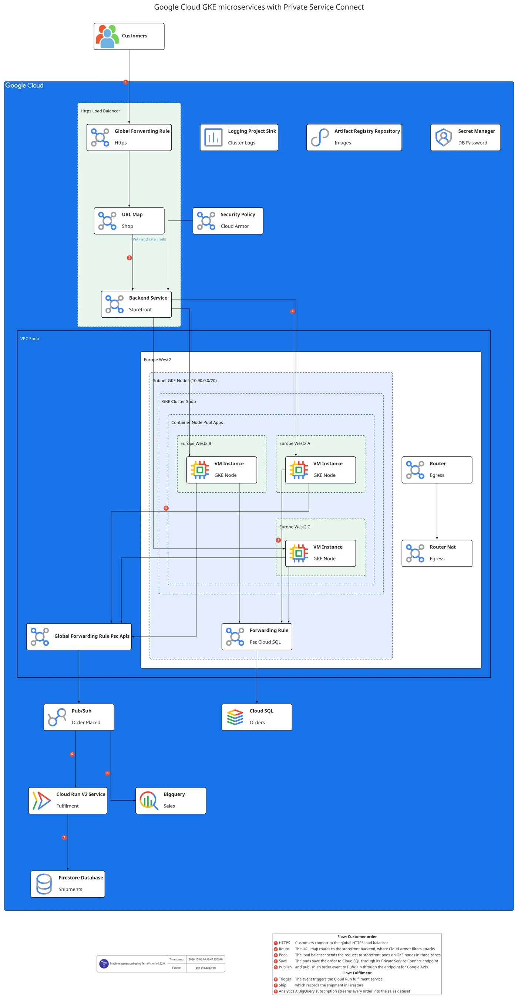{ width=1400 height=2592 loading=lazy .no-lightbox }](https://raw.githubusercontent.com/patrickchugh/terravision/main/examples/graphs/gcp-gke.png)

**Ask your AI assistant:**

> Draw a GKE microservices platform on Google Cloud: a global HTTPS load balancer with Cloud Armor, a regional GKE cluster with a node pool across three zones, a Private Service Connect endpoint for Cloud SQL in the node subnet, a Private Service Connect endpoint for Google APIs used to reach Pub/Sub, Pub/Sub triggering a Cloud Run service that writes to Firestore, a BigQuery dataset, Cloud NAT, Artifact Registry and Secret Manager.

**Or reproduce it exactly** from the source file [gcp-gke.tvg.json](https://github.com/patrickchugh/terravision/blob/main/examples/graphs/gcp-gke.tvg.json) and its CIDR ranges in [gcp-gke.annotations.yml](https://github.com/patrickchugh/terravision/blob/main/examples/graphs/gcp-gke.annotations.yml):

```bash
terravision draw --source gcp-gke.tvg.json --annotate gcp-gke.annotations.yml --format svg      # or png, pdf
terravision draw --source gcp-gke.tvg.json --annotate gcp-gke.annotations.yml --format drawio   # editable in draw.io or Lucidchart
```

Download: [PNG](https://raw.githubusercontent.com/patrickchugh/terravision/main/examples/graphs/gcp-gke.png) · [SVG](https://raw.githubusercontent.com/patrickchugh/terravision/main/examples/graphs/gcp-gke.svg) · [source graph](https://raw.githubusercontent.com/patrickchugh/terravision/main/examples/graphs/gcp-gke.tvg.json) · [CIDR annotations](https://raw.githubusercontent.com/patrickchugh/terravision/main/examples/graphs/gcp-gke.annotations.yml)

## Google Cloud data pipeline architecture diagram { #google-cloud-data-pipeline-architecture-diagram }

A streaming and batch data platform on Google Cloud whose processing runs inside a VPC network. In europe-west2, a processing subnet holds a streaming Dataflow job, a batch Dataflow load and a Dataproc Serverless Spark transform, and an orchestration subnet holds Cloud Composer. The jobs reach Pub/Sub, Cloud Storage, BigQuery and Bigtable through a Private Service Connect endpoint for Google APIs, and Datastream captures changes from Cloud SQL on a private IP. BigQuery holds raw and curated datasets, Bigtable holds real-time features and Dataplex governs the lake. Looker, a Vertex AI endpoint and a Cloud Run recommendations API serve the results.

[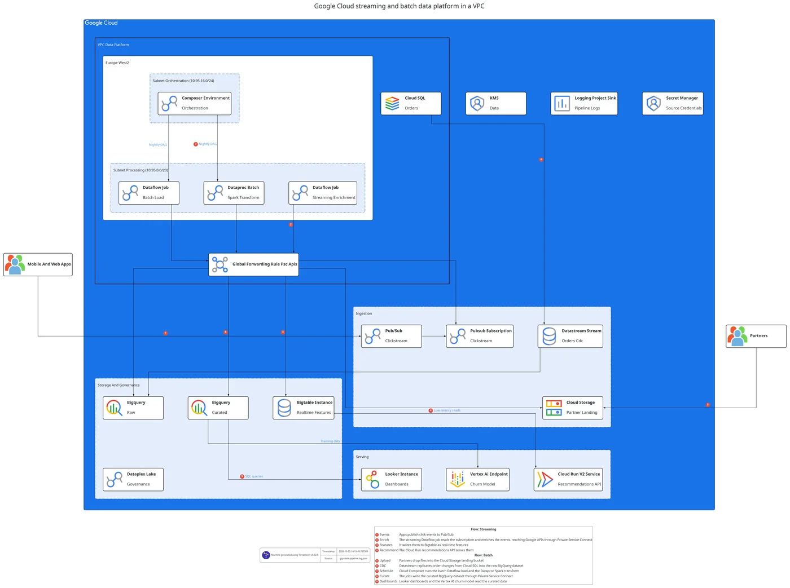{ width=1400 height=972 loading=lazy .no-lightbox }](https://raw.githubusercontent.com/patrickchugh/terravision/main/examples/graphs/gcp-data-pipeline.png)

**Ask your AI assistant:**

> Draw a Google Cloud data platform with processing in a VPC network: streaming and batch Dataflow jobs and a Dataproc Serverless transform in a processing subnet, Cloud Composer in an orchestration subnet, a Private Service Connect endpoint for Google APIs, and Cloud SQL on a private IP feeding Datastream. Pub/Sub and a Cloud Storage landing bucket for ingestion; raw and curated BigQuery datasets, Bigtable and Dataplex; Looker, Vertex AI and a Cloud Run API for serving.

**Or reproduce it exactly** from the source file [gcp-data-pipeline.tvg.json](https://github.com/patrickchugh/terravision/blob/main/examples/graphs/gcp-data-pipeline.tvg.json) and its CIDR ranges in [gcp-data-pipeline.annotations.yml](https://github.com/patrickchugh/terravision/blob/main/examples/graphs/gcp-data-pipeline.annotations.yml):

```bash
terravision draw --source gcp-data-pipeline.tvg.json --annotate gcp-data-pipeline.annotations.yml --format svg      # or png, pdf
terravision draw --source gcp-data-pipeline.tvg.json --annotate gcp-data-pipeline.annotations.yml --format drawio   # editable in draw.io or Lucidchart
```

Download: [PNG](https://raw.githubusercontent.com/patrickchugh/terravision/main/examples/graphs/gcp-data-pipeline.png) · [SVG](https://raw.githubusercontent.com/patrickchugh/terravision/main/examples/graphs/gcp-data-pipeline.svg) · [source graph](https://raw.githubusercontent.com/patrickchugh/terravision/main/examples/graphs/gcp-data-pipeline.tvg.json) · [CIDR annotations](https://raw.githubusercontent.com/patrickchugh/terravision/main/examples/graphs/gcp-data-pipeline.annotations.yml)

## How were these diagrams made?

Each one is a short JSON file that lists the resources and what they connect to or sit inside, rendered by TerraVision. An AI assistant writes that file for you from a plain-English description, or TerraVision derives the diagram from Terraform code. A diagram drawn from a prompt will differ in detail from the example; the source file reproduces it exactly.

The CIDR ranges on networks and subnets come from a small annotation file next to each graph, using `update:`; your assistant sets them through the `attributes` option when it draws. Annotation files with graphs need TerraVision 0.52.0 or later.

## Can I get logical groups like these from Terraform?

Yes. Groups such as "Fulfilment workflow" or "Ingestion" are part of the graph. Ask your assistant for them when you describe a design. Starting from Terraform, export the graph with `terravision graphdata --source ./infra --outfile architecture.tvg.json`, add the groups to the JSON (or ask your assistant to), and draw it with `terravision draw --source architecture.tvg.json`.

## Can I edit these diagrams?

Yes. Ask your assistant to change the design in plain words, or render the source file with `--format drawio` and open it in draw.io or Lucidchart to move, restyle or annotate anything by hand. SVG output opens in any vector editor.

## Can I use these diagrams in client documents and presentations?

Yes. TerraVision's AGPL-3.0 licence covers the software, not the diagrams you make with it, so you can use them in proposals, client documents, slides and books, commercially or not. The cloud icons belong to AWS, Microsoft and Google, which allow their use in architecture diagrams; follow their guidelines, such as not distorting or recolouring the icons.

## Can I get the Terraform for one of these architectures?

Yes. After drawing a design with your AI assistant, ask it to write the Terraform. See [diagram to Terraform](diagram-to-terraform.md).

## Related

- [AI cloud architecture diagram generator](ai-cloud-architecture-diagram-generator.md)
- [AWS](aws-architecture-diagram-generator.md), [Azure](azure-architecture-diagram-generator.md) and [Google Cloud](gcp-architecture-diagram-generator.md) diagram generators
- [Graph Format](graph-format.md): write or edit the source files yourself
