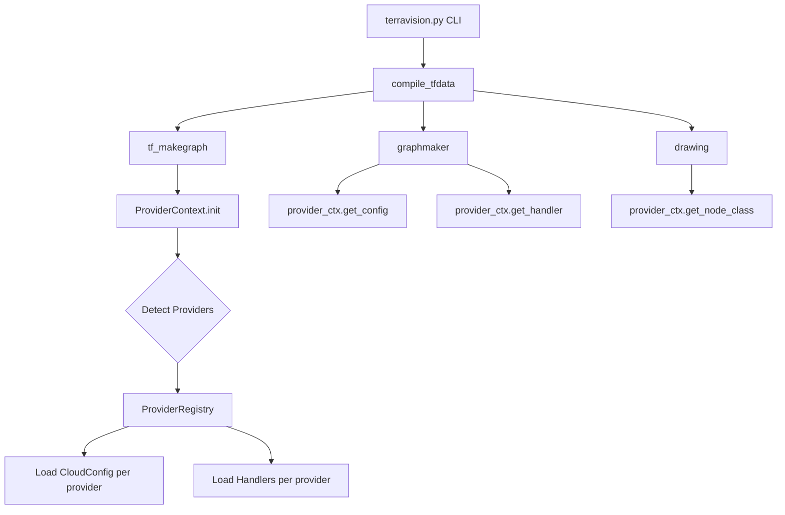

# SPEC-001: Provider Abstraction Layer (ProviderContext & ProviderRegistry)

**Status:** Draft  
**Version:** 1.0  
**Release Target:** v0.9  
**Priority:** P0 (Critical Blocker)  
**Effort Estimate:** 20 story points (~3-4 days)

---

## Overview

Introduce a Provider Abstraction Layer that decouples cloud-specific logic from core TerraVision graph building and rendering modules. This enables multi-cloud support for Azure, GCP, and future providers without modifying core logic.

### Related Documents
- **ROADMAP.md** (lines 42-47, 211-226)
- **ARCHITECTURAL.md** (lines 100-111, 299-307, 428-469)
- **CODEREVIEW.md** (lines 8-25)

### Related Specs
- SPEC-002: CloudConfig Refactor
- SPEC-003: Service Mapping Module
- SPEC-008: Azure Provider Support
- SPEC-009: GCP Provider Support

---

## Problem Statement

### Current State
TerraVision v0.8 is AWS-only with hard-coded dependencies throughout the codebase:
- `modules/cloud_config.py` contains AWS_* constants imported by graphmaker, drawing, helpers, annotations
- `modules/drawing.py` uses wildcard imports from `resource_classes.aws.*`
- `modules/tfwrapper.py` validates AWS provider presence only
- No provider abstraction exists

### Impact
- **Blocks** Azure/GCP support entirely
- Requires pervasive refactors to add new providers
- Increases maintenance burden and technical debt

---

## Requirements

### Functional Requirements

#### FR-1: Provider Discovery and Registration
- System SHALL auto-detect active providers from Terraform plan/HCL
- System SHALL register provider descriptors for aws, azurerm, google
- System SHALL support mixed-provider graphs (multiple providers in one diagram)

#### FR-2: Provider Context Management
- System SHALL maintain ProviderContext with provider_id per node
- System SHALL provide provider-specific config access via ProviderContext
- System SHALL dispatch provider-specific handlers through ProviderContext

#### FR-3: Backwards Compatibility
- System SHALL default to AWS provider when not specified
- System SHALL maintain existing AWS diagram behavior without regression
- System SHALL deprecate direct AWS_* imports with warnings in logs

### Non-Functional Requirements

#### NFR-1: Performance
- Provider detection SHALL add <100ms overhead to graph compilation
- Provider config loading SHALL be lazy and cached per provider

#### NFR-2: Extensibility
- Adding new provider SHALL require only:
  1. Provider descriptor registration
  2. CloudConfig module implementation
  3. Resource handler module implementation
- No core module changes required for new providers

#### NFR-3: Testability
- Provider abstraction SHALL support mocking for unit tests
- Each provider SHALL have isolated test fixtures

---

## Architecture

### High-Level Design



### Component Specifications

#### ProviderDescriptor
**File:** `modules/provider_runtime.py`

```python
from dataclasses import dataclass
from typing import Tuple

@dataclass
class ProviderDescriptor:
    """Descriptor for a Terraform provider.
    
    Attributes:
        id: Unique provider identifier (e.g., 'aws', 'azurerm', 'google')
        resource_prefixes: Tuple of resource name prefixes (e.g., ('aws_', 'module.*.aws_'))
        cloud_config_module: Import path to CloudConfig module (e.g., 'modules.cloud_config.aws')
        handler_module: Import path to ResourceHandlers module (e.g., 'resource_handlers.aws')
    """
    id: str
    resource_prefixes: Tuple[str, ...]
    cloud_config_module: str
    handler_module: str
```

**Validation:**
- `id` must be lowercase alphanumeric
- `resource_prefixes` must be non-empty tuple
- Module paths must be importable

---

#### ProviderContext
**File:** `modules/provider_runtime.py`

```python
from typing import Dict, Optional, Callable, Any
import importlib

class ProviderContext:
    """Manages provider lifecycle and provides provider-specific services.
    
    Responsibilities:
        - Register and discover providers
        - Detect provider for each resource node
        - Load and cache provider configs
        - Dispatch provider-specific handlers
    """
    
    def __init__(self, descriptors: Dict[str, ProviderDescriptor]):
        """Initialize ProviderContext with provider descriptors.
        
        Args:
            descriptors: Dict mapping provider_id -> ProviderDescriptor
        """
        self.descriptors = descriptors
        self._configs = {}   # Lazy-loaded config modules
        self._handlers = {}  # Lazy-loaded handler modules
    
    def detect_provider_for_node(self, node: str) -> Optional[str]:
        """Detect provider from resource node name.
        
        Args:
            node: Resource node name (e.g., 'aws_instance.web', 'module.vpc.aws_subnet.private')
            
        Returns:
            Provider ID if detected, None otherwise
            
        Algorithm:
            1. Extract resource type from node name
            2. Match against registered provider prefixes
            3. Return first matching provider_id
        """
        for provider_id, descriptor in self.descriptors.items():
            for prefix in descriptor.resource_prefixes:
                if self._matches_prefix(node, prefix):
                    return provider_id
        return None
    
    def get_config(self, provider_id: str) -> Any:
        """Get CloudConfig module for provider.
        
        Args:
            provider_id: Provider identifier
            
        Returns:
            Loaded CloudConfig module
            
        Raises:
            KeyError: If provider_id not registered
            ImportError: If config module cannot be imported
            
        Caching:
            Config modules are loaded once and cached
        """
        if provider_id not in self.descriptors:
            raise KeyError(f"Unknown provider: {provider_id}")
        
        if provider_id not in self._configs:
            descriptor = self.descriptors[provider_id]
            self._configs[provider_id] = importlib.import_module(
                descriptor.cloud_config_module
            )
        
        return self._configs[provider_id]
    
    def get_handler(self, provider_id: str) -> Any:
        """Get ResourceHandlers module for provider.
        
        Args:
            provider_id: Provider identifier
            
        Returns:
            Loaded ResourceHandlers module
            
        Raises:
            KeyError: If provider_id not registered
            ImportError: If handler module cannot be imported
            
        Caching:
            Handler modules are loaded once and cached
        """
        if provider_id not in self.descriptors:
            raise KeyError(f"Unknown provider: {provider_id}")
        
        if provider_id not in self._handlers:
            descriptor = self.descriptors[provider_id]
            self._handlers[provider_id] = importlib.import_module(
                descriptor.handler_module
            )
        
        return self._handlers[provider_id]
    
    def consolidate(self, provider_id: str, resource_type: str) -> Optional[str]:
        """Get consolidated resource type if applicable.
        
        Args:
            provider_id: Provider identifier
            resource_type: Original resource type
            
        Returns:
            Consolidated type name or None
        """
        config = self.get_config(provider_id)
        consolidated = getattr(config, 'CONSOLIDATED_NODES', {})
        return consolidated.get(resource_type)
    
    def map_variant(self, provider_id: str, resource_type: str, metadata: dict) -> Optional[str]:
        """Map resource to variant type based on metadata.
        
        Args:
            provider_id: Provider identifier
            resource_type: Original resource type
            metadata: Resource metadata dictionary
            
        Returns:
            Variant type name or None
            
        Algorithm:
            1. Get NODE_VARIANTS mapping from provider config
            2. For each variant rule in resource_type variants
            3. Check if metadata matches variant criteria
            4. Return first matching variant
        """
        config = self.get_config(provider_id)
        variants = getattr(config, 'NODE_VARIANTS', {})
        
        if resource_type not in variants:
            return None
        
        variant_rules = variants[resource_type]
        for keyword, variant_type in variant_rules.items():
            if self._metadata_matches_keyword(metadata, keyword):
                return variant_type
        
        return None
    
    def implied_connections(self, provider_id: str, param: str) -> list:
        """Get implied connection targets for parameter.
        
        Args:
            provider_id: Provider identifier
            param: Parameter name or value
            
        Returns:
            List of target resource prefixes
        """
        config = self.get_config(provider_id)
        connections = getattr(config, 'IMPLIED_CONNECTIONS', {})
        return connections.get(param, [])
    
    @staticmethod
    def _matches_prefix(node: str, prefix: str) -> bool:
        """Check if node matches provider prefix pattern.
        
        Handles:
            - Direct prefix: 'aws_instance.web' matches 'aws_'
            - Module prefix: 'module.vpc.aws_subnet.private' matches 'module.*.aws_'
        """
        # Direct match
        if node.startswith(prefix):
            return True
        
        # Module pattern match
        if 'module.*.' in prefix:
            pattern = prefix.replace('module.*.', r'module\.[^.]+\.')
            import re
            return bool(re.search(pattern, node))
        
        return False
    
    @staticmethod
    def _metadata_matches_keyword(metadata: dict, keyword: str) -> bool:
        """Check if metadata contains keyword for variant matching."""
        metadata_str = str(metadata).lower()
        return keyword.lower() in metadata_str
```

---

#### ProviderRegistry (Module-Level Initialization)
**File:** `modules/provider_runtime.py`

```python
# Default provider registry initialization
DEFAULT_PROVIDERS = {
    'aws': ProviderDescriptor(
        id='aws',
        resource_prefixes=('aws_', 'module.*.aws_'),
        cloud_config_module='modules.cloud_config.aws',
        handler_module='resource_handlers.aws'
    ),
    'azurerm': ProviderDescriptor(
        id='azurerm',
        resource_prefixes=('azurerm_', 'module.*.azurerm_'),
        cloud_config_module='modules.cloud_config.azure',
        handler_module='resource_handlers.azure'
    ),
    'google': ProviderDescriptor(
        id='google',
        resource_prefixes=('google_', 'module.*.google_'),
        cloud_config_module='modules.cloud_config.gcp',
        handler_module='resource_handlers.gcp'
    )
}

def create_provider_context(descriptors: Dict[str, ProviderDescriptor] = None) -> ProviderContext:
    """Factory function to create ProviderContext.
    
    Args:
        descriptors: Custom provider descriptors (defaults to DEFAULT_PROVIDERS)
        
    Returns:
        Initialized ProviderContext
    """
    if descriptors is None:
        descriptors = DEFAULT_PROVIDERS
    return ProviderContext(descriptors)
```

---

### Integration Points

#### tfdata Structure Additions
**File:** `terravision.py` (compile_tfdata function)

Add to `tfdata` dictionary:
```python
tfdata["providers"] = Set[str]          # Detected provider IDs
tfdata["node_provider_map"] = Dict[str, str]  # node -> provider_id
tfdata["provider_ctx"] = ProviderContext      # Runtime context (not serialized)
```

#### tfdata.meta_data Additions
For each node in `tfdata["meta_data"][node]`:
```python
{
    ...existing fields...,
    "provider": str,          # Provider ID (e.g., 'aws', 'azurerm')
    "category": Optional[str] # Canonical category (compute/network/storage)
}
```

---

#### Module Refactors

**1. terravision.py - compile_tfdata**
```python
def compile_tfdata(source, ..., provider_ctx=None):
    """Compile Terraform data with provider context.
    
    Changes:
        - Initialize ProviderContext after tf_makegraph
        - Populate tfdata["providers"] and tfdata["node_provider_map"]
        - Pass provider_ctx to graphmaker, annotations, drawing
    """
    # Existing: preflight_check, tf_initplan, tf_makegraph
    
    # NEW: Initialize provider context
    if provider_ctx is None:
        provider_ctx = create_provider_context()
    tfdata["provider_ctx"] = provider_ctx
    
    # NEW: Detect providers and populate node_provider_map
    tfdata["providers"] = set()
    tfdata["node_provider_map"] = {}
    
    for node in tfdata.get("node_list", []):
        provider_id = provider_ctx.detect_provider_for_node(node)
        if provider_id:
            tfdata["providers"].add(provider_id)
            tfdata["node_provider_map"][node] = provider_id
            # Add to meta_data
            if node not in tfdata["meta_data"]:
                tfdata["meta_data"][node] = {}
            tfdata["meta_data"][node]["provider"] = provider_id
    
    # Existing: fileparser.read_tfsource, interpreter
    
    # MODIFIED: Pass provider_ctx to modules
    tfdata = resource_handlers.handle_special_cases(tfdata, provider_ctx)
    tfdata = graphmaker.consolidate_nodes(tfdata, provider_ctx)
    tfdata = graphmaker.handle_variants(tfdata, provider_ctx)
    tfdata = graphmaker.reverse_relations(tfdata, provider_ctx)
    tfdata = annotations.add_annotations(tfdata, provider_ctx)
    
    return tfdata
```

**2. modules/graphmaker.py - Functions Refactor**
```python
# BEFORE
from modules.cloud_config import AWS_GROUP_NODES, AWS_CONSOLIDATED_NODES

def consolidate_nodes(tfdata):
    for node in tfdata["node_list"]:
        if node in AWS_CONSOLIDATED_NODES:
            # ...

# AFTER
def consolidate_nodes(tfdata, provider_ctx):
    """Consolidate nodes using provider-specific rules.
    
    Args:
        tfdata: Terraform data dictionary
        provider_ctx: ProviderContext instance
    """
    for node in tfdata["node_list"]:
        provider_id = tfdata["meta_data"][node].get("provider")
        if not provider_id:
            continue
        
        resource_type = helpers.get_no_module_name(node).split('.')[0]
        consolidated = provider_ctx.consolidate(provider_id, resource_type)
        
        if consolidated:
            # ... existing consolidation logic using consolidated type
```

**Similar refactors required for:**
- `handle_variants(tfdata, provider_ctx)`
- `reverse_relations(tfdata, provider_ctx)`
- `add_relations(tfdata, provider_ctx)`
- `create_multiple_resources(tfdata, provider_ctx)`

**3. modules/annotations.py - AUTO_ANNOTATIONS**
```python
# BEFORE
from modules.cloud_config import AWS_AUTO_ANNOTATIONS

def add_annotations(tfdata, user_annotations=None):
    auto_annotations = AWS_AUTO_ANNOTATIONS
    # ...

# AFTER
def add_annotations(tfdata, provider_ctx, user_annotations=None):
    """Add annotations using provider-specific rules.
    
    Args:
        tfdata: Terraform data dictionary
        provider_ctx: ProviderContext instance
        user_annotations: Optional user-defined annotations
    """
    # Collect auto annotations from all active providers
    auto_annotations = {}
    for provider_id in tfdata.get("providers", []):
        config = provider_ctx.get_config(provider_id)
        provider_auto = getattr(config, 'AUTO_ANNOTATIONS', {})
        auto_annotations.update(provider_auto)
    
    # ... existing annotation logic
```

**4. modules/tfwrapper.py - Provider Validation**
```python
# BEFORE (lines 451-459)
def tf_makegraph(tfdata, debug=False):
    # ...
    if not any('aws_' in r for r in tfdata["tf_resources_created"]):
        click.echo("ERROR: No AWS resources detected")
        sys.exit(1)

# AFTER
def tf_makegraph(tfdata, debug=False):
    """Generate graph with provider-agnostic validation.
    
    Changes:
        - Remove AWS-only check
        - Validate any supported provider present
        - Populate tf_resources_created for provider detection
    """
    # ... existing graph generation ...
    
    # NEW: Provider-agnostic validation
    supported_prefixes = ['aws_', 'azurerm_', 'google_', 'kubernetes_']
    has_supported = any(
        any(prefix in r for prefix in supported_prefixes)
        for r in tfdata["tf_resources_created"]
    )
    
    if not has_supported:
        click.echo(click.style(
            "\nWARNING: No supported cloud resources detected. "
            "Supported providers: AWS, Azure, GCP, Kubernetes",
            fg="yellow"
        ))
    
    return tfdata
```

**5. modules/drawing.py - Wildcard Import Removal**
(Detailed in SPEC-002 and SPEC-006)

---

## Data Contracts

### Input: Terraform Plan Resource List
**Source:** `tfdata["tf_resources_created"]` from tf_makegraph

```python
tf_resources_created = [
    "aws_instance.web",
    "aws_vpc.main",
    "azurerm_virtual_network.vnet",
    "google_compute_network.vpc",
    "module.networking.aws_subnet.private"
]
```

### Output: Provider Detection Results
**Stored in:** `tfdata["providers"]`, `tfdata["node_provider_map"]`

```python
tfdata["providers"] = {'aws', 'azurerm', 'google'}

tfdata["node_provider_map"] = {
    "aws_instance.web": "aws",
    "aws_vpc.main": "aws",
    "azurerm_virtual_network.vnet": "azurerm",
    "google_compute_network.vpc": "google",
    "module.networking.aws_subnet.private": "aws"
}
```

### Output: Provider Config Access
**Via:** `provider_ctx.get_config(provider_id)`

Returns CloudConfig module with:
```python
CONSOLIDATED_NODES: Dict[str, Dict]
GROUP_NODES: List[str]
EDGE_NODES: List[str]
DRAW_ORDER: List
NODE_VARIANTS: Dict[str, Dict]
AUTO_ANNOTATIONS: Dict
REVERSE_ARROW_LIST: List[str]
IMPLIED_CONNECTIONS: Dict[str, List]
SHARED_SERVICES: List[str]
# ... other provider-specific constants
```

---

## Testing Requirements

### Unit Tests

#### Test: Provider Detection
**File:** `tests/provider_runtime_unit_test.py`

```python
def test_detect_aws_provider():
    """Test detection of AWS provider from resource names."""
    ctx = create_provider_context()
    
    assert ctx.detect_provider_for_node("aws_instance.web") == "aws"
    assert ctx.detect_provider_for_node("module.vpc.aws_subnet.private") == "aws"
    assert ctx.detect_provider_for_node("data.aws_ami.ubuntu") == "aws"

def test_detect_azure_provider():
    """Test detection of Azure provider from resource names."""
    ctx = create_provider_context()
    
    assert ctx.detect_provider_for_node("azurerm_virtual_network.vnet") == "azurerm"
    assert ctx.detect_provider_for_node("module.network.azurerm_subnet.web") == "azurerm"

def test_detect_gcp_provider():
    """Test detection of GCP provider from resource names."""
    ctx = create_provider_context()
    
    assert ctx.detect_provider_for_node("google_compute_network.vpc") == "google"
    assert ctx.detect_provider_for_node("google_compute_instance.web") == "google"

def test_detect_unknown_provider():
    """Test handling of unknown provider."""
    ctx = create_provider_context()
    
    assert ctx.detect_provider_for_node("unknown_resource.test") is None
```

#### Test: Config Loading and Caching
```python
def test_config_loading():
    """Test lazy loading and caching of provider configs."""
    ctx = create_provider_context()
    
    # First access loads module
    config1 = ctx.get_config('aws')
    assert hasattr(config1, 'CONSOLIDATED_NODES')
    
    # Second access returns cached module
    config2 = ctx.get_config('aws')
    assert config1 is config2  # Same object

def test_config_unknown_provider():
    """Test error handling for unknown provider."""
    ctx = create_provider_context()
    
    with pytest.raises(KeyError):
        ctx.get_config('unknown')
```

#### Test: Consolidation and Variants
```python
def test_consolidate():
    """Test provider-specific consolidation mapping."""
    ctx = create_provider_context()
    
    # AWS example
    consolidated = ctx.consolidate('aws', 'aws_alb')
    assert consolidated is not None  # Should map to aws_lb
    
def test_map_variant():
    """Test variant mapping based on metadata."""
    ctx = create_provider_context()
    
    metadata = {"load_balancer_type": "network"}
    variant = ctx.map_variant('aws', 'aws_lb', metadata)
    # Should return network load balancer variant
```

### Integration Tests

#### Test: Multi-Provider Graph
**File:** `tests/integration_test.py`

```python
def test_mixed_provider_detection():
    """Test detection of multiple providers in single graph."""
    tfdata = {
        "tf_resources_created": [
            "aws_instance.web",
            "azurerm_virtual_network.vnet",
            "google_compute_network.vpc"
        ],
        "node_list": [
            "aws_instance.web",
            "azurerm_virtual_network.vnet",
            "google_compute_network.vpc"
        ],
        "meta_data": {}
    }
    
    provider_ctx = create_provider_context()
    tfdata["provider_ctx"] = provider_ctx
    tfdata["providers"] = set()
    tfdata["node_provider_map"] = {}
    
    # Populate provider mappings
    for node in tfdata["node_list"]:
        provider_id = provider_ctx.detect_provider_for_node(node)
        if provider_id:
            tfdata["providers"].add(provider_id)
            tfdata["node_provider_map"][node] = provider_id
    
    assert tfdata["providers"] == {'aws', 'azurerm', 'google'}
    assert tfdata["node_provider_map"]["aws_instance.web"] == "aws"
    assert tfdata["node_provider_map"]["azurerm_virtual_network.vnet"] == "azurerm"
    assert tfdata["node_provider_map"]["google_compute_network.vpc"] == "google"
```

### Regression Tests

#### Test: AWS Backwards Compatibility
```python
def test_aws_only_graph_unchanged():
    """Verify AWS-only graphs behave identically to v0.8."""
    # Load v0.8 expected output
    with open('tests/json/bastion-expected.json') as f:
        expected = json.load(f)
    
    # Generate with provider context
    tfdata = compile_tfdata('tests/fixtures/bastion-aws-only')
    
    # Assert output matches v0.8 (allowing for provider metadata additions)
    assert_graphs_equivalent(tfdata, expected)
```

---

## Acceptance Criteria

### Must Have (v0.9)
- [ ] ProviderDescriptor dataclass implemented with validation
- [ ] ProviderContext class with all specified methods
- [ ] DEFAULT_PROVIDERS registry includes aws, azurerm, google
- [ ] Provider detection correctly identifies providers from resource names
- [ ] Provider detection handles module-prefixed resources
- [ ] Config loading is lazy and cached per provider
- [ ] tfdata structure includes providers, node_provider_map, provider_ctx
- [ ] tfdata.meta_data includes provider field for each node
- [ ] All unit tests pass (≥95% code coverage for provider_runtime.py)
- [ ] Integration test verifies multi-provider detection
- [ ] AWS backwards compatibility test passes (no regression)
- [ ] Documentation: Docstrings for all public methods (Google style)

### Should Have (v0.9)
- [ ] Performance test: provider detection <100ms for 100-node graph
- [ ] Error handling: descriptive errors for invalid provider_id
- [ ] Logging: debug logs for provider detection and config loading
- [ ] CLI: --provider flag (optional, for future use; auto-detect for now)

### Nice to Have (v1.0)
- [ ] Provider descriptor YAML config file support
- [ ] Provider registration at runtime (plugin system foundation)
- [ ] Provider precedence rules for ambiguous nodes

---

## Migration Guide

### For Users
**No user-facing changes required for v0.9:**
- AWS-only projects continue to work identically
- Multi-provider detection is automatic
- No CLI changes (--provider flag optional for future use)

### For Developers/Extenders
**Breaking Changes:**
- Direct imports of `modules.cloud_config.AWS_*` deprecated
- Functions in graphmaker, annotations, helpers now require `provider_ctx` parameter

**Migration Steps:**
```python
# BEFORE (v0.8)
from modules.cloud_config import AWS_GROUP_NODES

def my_function(tfdata):
    for node in tfdata["node_list"]:
        if node in AWS_GROUP_NODES:
            # ...

# AFTER (v0.9)
def my_function(tfdata, provider_ctx):
    for node in tfdata["node_list"]:
        provider_id = tfdata["meta_data"][node].get("provider")
        if not provider_id:
            continue
        
        config = provider_ctx.get_config(provider_id)
        group_nodes = getattr(config, 'GROUP_NODES', [])
        
        resource_type = helpers.get_no_module_name(node).split('.')[0]
        if resource_type in group_nodes:
            # ...
```

---

## Implementation Plan

### Sprint 1 (Week 1-2)
**Tasks:**
1. Create `modules/provider_runtime.py` with ProviderDescriptor and ProviderContext
2. Implement DEFAULT_PROVIDERS registry
3. Write unit tests for provider detection and config loading
4. Update terravision.py compile_tfdata to initialize provider_ctx
5. Add tfdata structure fields (providers, node_provider_map)

**Deliverables:**
- Working ProviderContext with AWS-only functionality
- Unit tests ≥95% coverage
- Documentation (docstrings)

### Sprint 2 (Week 3-4)
**Tasks:**
1. Refactor graphmaker functions to accept provider_ctx
2. Refactor annotations to use provider_ctx
3. Update tfwrapper provider validation
4. Write integration tests for multi-provider graphs
5. Regression testing for AWS backwards compatibility

**Deliverables:**
- All core modules use ProviderContext
- Integration tests pass
- No AWS regression

---

## Dependencies

### Blockers (Must Complete First)
- None (foundational work)

### Enables (Unblocks These)
- SPEC-002: CloudConfig Refactor (needs ProviderContext interface)
- SPEC-003: Service Mapping (uses ProviderContext)
- SPEC-008: Azure Provider Support (requires ProviderContext)
- SPEC-009: GCP Provider Support (requires ProviderContext)

### Concurrent Work Possible
- SPEC-004: Critical Bug Fixes (independent)
- SPEC-005: Critical Security Fixes (independent)

---

## Risks and Mitigations

### Risk 1: Hidden AWS Coupling Surfaces Late
**Impact:** Medium  
**Probability:** High  
**Mitigation:**
- Incremental refactoring with mypy strict mode
- Comprehensive grep for AWS_* imports
- Extensive unit test coverage

### Risk 2: Performance Degradation from Abstraction
**Impact:** High  
**Probability:** Medium  
**Mitigation:**
- Early profiling in Sprint 1
- Lazy loading and caching of configs
- Performance benchmarks as acceptance criteria

### Risk 3: Backwards Compatibility Regression
**Impact:** High  
**Probability:** Low  
**Mitigation:**
- Regression test suite vs v0.8 snapshots
- Feature flag to disable provider_ctx if needed
- AWS default provider maintains existing behavior

---

## Open Questions

1. **Provider Precedence:** How to handle nodes that match multiple providers?
   - **Decision Needed:** First-match vs explicit priority list
   - **Impact:** Multi-provider graph edge cases

2. **Module-Level Providers:** How to handle modules with mixed providers?
   - **Decision Needed:** Allow per-resource provider or enforce single provider per module
   - **Impact:** Complex module support

3. **Provider Metadata in JSON Export:** Should we include provider field in exported JSON?
   - **Decision Needed:** Yes (useful for consumers) vs No (backwards compat)
   - **Impact:** API breaking change vs usability

**Decisions for Next Planning Meeting:**
- Questions 1, 2, 3

---

## References

- **ARCHITECTURAL.md:** Provider Abstraction Layer design (lines 100-111, 428-469)
- **ROADMAP.md:** v0.9 Foundation Release (lines 33-81)
- **CODEREVIEW.md:** Critical Issues blocking multi-cloud (lines 8-25)
- **Python Importlib:** https://docs.python.org/3/library/importlib.html
- **Python Dataclasses:** https://docs.python.org/3/library/dataclasses.html

---

**Document Control:**
- **Created:** 2025-01-26
- **Last Updated:** 2025-01-26
- **Next Review:** Before Sprint 1 kickoff
- **Approvers:** Platform Lead, Architecture Review
